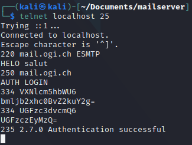
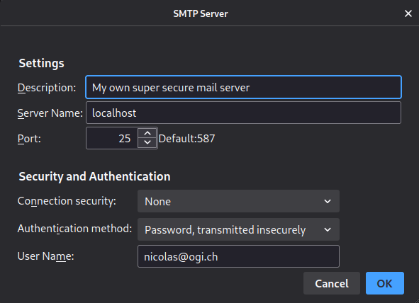
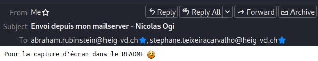
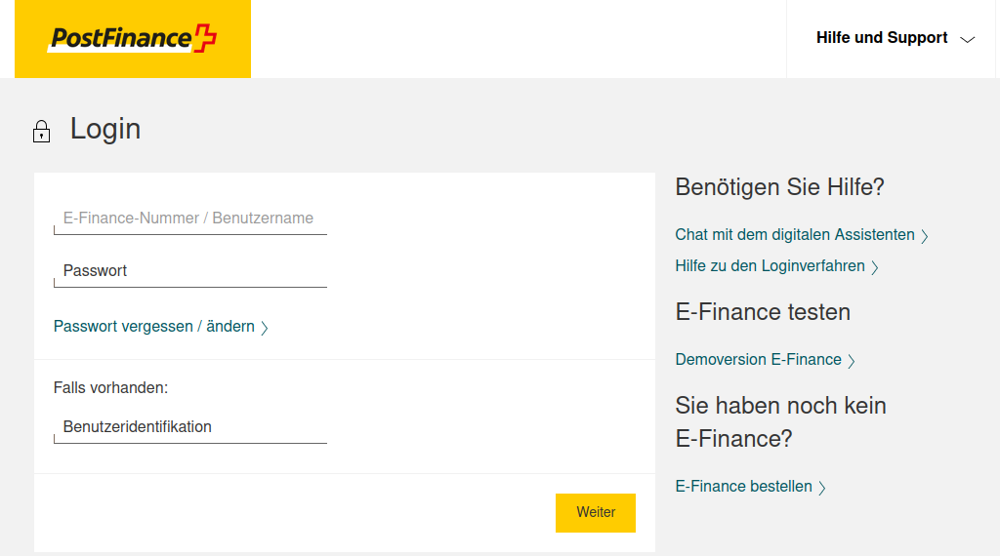
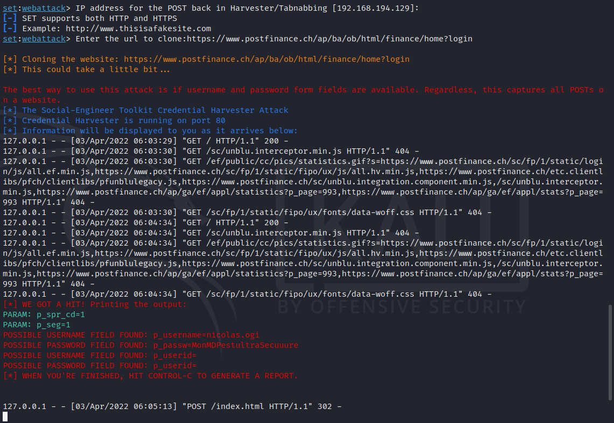
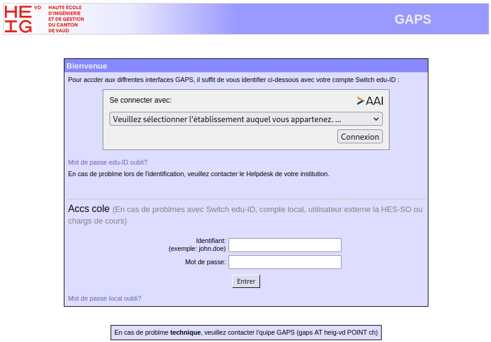
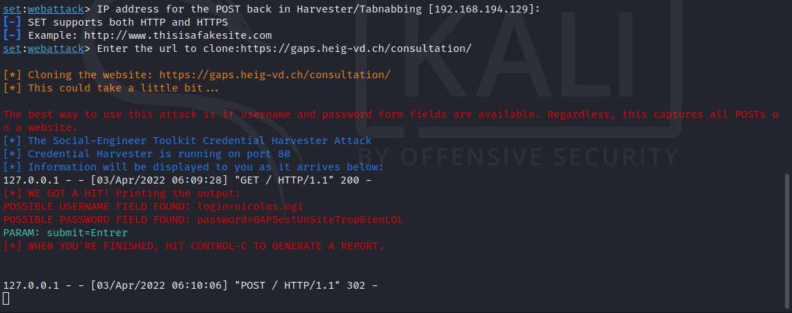
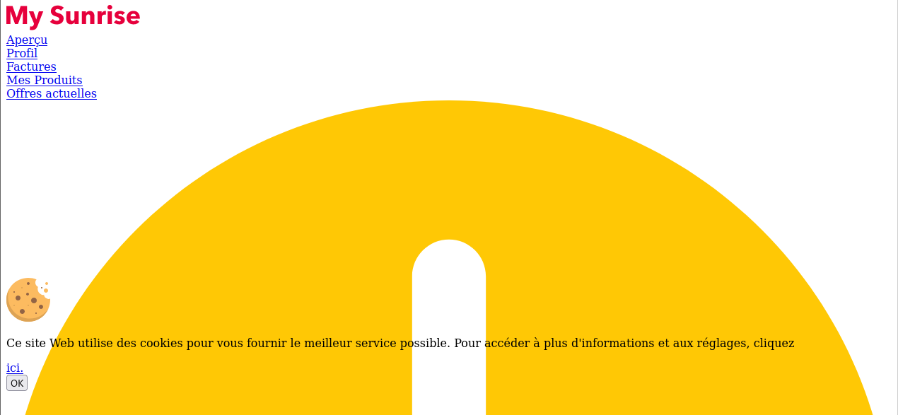
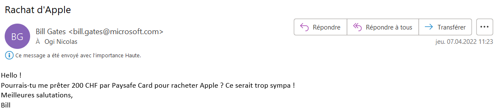
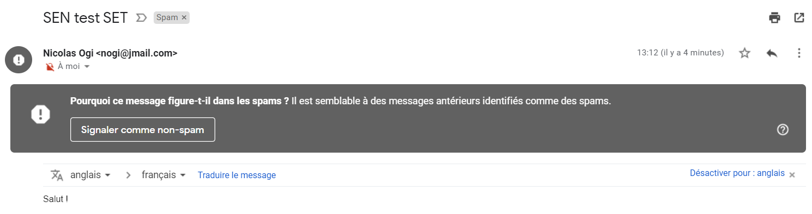

# Teaching-HEIGVD-SEN-2022-Laboratoire-Docker-Mail et SET


## Introduction

L'un des outils le plus important dans l'arsenal d'un ingénieur social c'est l'email.

L'ingénierie sociale implique très souvent des interactions avec la cible. Ces interactions sont facilitées de nos jours par l'ubiquité des communications numériques. Il est tout à fait normal de recevoir des instructions par email de la part de supérieurs hiérarchiques ou des collègues pour réaliser toute sorte de tâches. Les destins de pays, des opérations financières multimilliardaires, des plans de construction d'un nouvel appareil; tout peut être transmis par email.

L'email est aussi utilisé pour les relations privées. Ça peut être donc la voie de communication avec des membres de la famille, des amis, les conjoints, les fils et parents.

Pour complémenter le travail réalisé pour apprendre à connaitre la cible afin de la compromettre, l'ingénieur social a souvent besoin de délivrer une payload utilisant le même canal de communication. L'utilisation d'un serveur mail public devient parfois compliqué. Si on essaie de faire une campagne de phishing, par exemple, l'émission d'un grand nombre de messages à des destinations différentes peut soulever une alarme qui vous met dans une liste noire. L'utilisation de certaines payloads peut aussi être détectée par votre serveur mail d'envoi.

Il est donc très intéressant de ne pas dépendre d'un serveur mail public. Vous pouvez configurer votre propre serveur email avec quelques manipulations très simples. Ce serveur vous appartient. Il acceptera de faire tout ce que vous lui demanderez de faire, sans poser des questions.


## Une petite note sur l'éthique

Il n'est absolument pas acceptable d'attaquer quelqu'un pour quelque raison que ce soit.

L'utilisation de ces outils à des fins autres que votre propre éducation et formation sans autorisation est strictement interdite par les politiques de ce cours et de l'école, ainsi que par les lois.

Le but de cet exercice est de vous permettre de vous familiariser avec les outils et comment ils peuvent être utilisés dans le contexte professionnel d'un pentest. Ça vous permettra aussi de comprendre les tactiques de l'adversaire afin de pouvoir les contrer par le biais de la politique, de l'éducation et de la formation.


## Que faut-il faire ?

Voici les activités à réalise dans ce laboratoire. Vous devez :

- Installer, configurer et tester votre propre serveur mail
- Installer le Social Engineering Toolkit (SET)
- Créer un collecteur d'identifiants (credential harvester)
- Capturer certains identifiants utilisateur (les vôtres)
- Créer une attaque de mailing utilisant SET et votre propre serveur mail

Le "rapport" de ce labo est très simple : **Pour chaque tâche, faites des captures d'écran de vos activités et répondez les éventuelles questions**.

## Docker Mailserver

Le projet [Docker Mailserver](https://github.com/docker-mailserver/docker-mailserver) est un système très complet et sophistiqué qui vous permet d'installer et utiliser votre propre serveur mail. Il est en même temps très simple et inclut des fonctionnalités avancées comme des filtres de spam et antivirus (justement ce que l'on veut éviter...).

Vous pouvez visiter le site du projet et apprendre beaucoup de choses à propos de cet outil très puissant. Nous allons pourtant nous contenter de faire un nombre assez réduit de manipulations dans le but de le faire fonctionner rapidement et avec peu d'effort. Ce n'est de loin la bonne utilisation de ce produit. En effet, il peut être déployé pour une utilisation en production.

Notre scénario c'est celui d'un attaquant qui se sert de ce serveur pour délivrer des emails de phishing, par exemple, voir des payloads. Notre configuration de base ne nous permettra pas de recevoir des réponses aux mails. Si vous voulez être capable de recevoir des réponses (ce qui peut être le cas dans certains scénarios), il faudra faire du travail supplémentaire pour installer et configurer un serveur DNS capable de fournir des "MX records". La [documentation très complète de Docker Mailserver](https://docker-mailserver.github.io/docker-mailserver/edge/) contient entre autres les informations nécessaires pour configurer votre DNS. L'installation de certificats est aussi normalement importante, mais ce ne sera pas fait pour le moment.

### Configuration minimaliste de Docker Mailserver

Nous avons testé ce guide sur Kali Linux et macOS Monterey. Son utilisation devrait être possible sur Windows avec peu ou pas de modification. Il vous faudra comprendre votre propre infrastructure afin de faire interagir correctement tous les éléments.

Nous allons commencer par créer un répertoire "mailserver" et entrer dedans (ce guide part du principe que vous avez déjà Docker et Docker Compose installés et correctement configurés sur votre plateforme).

```bash
mkdir mailserver
cd mailserver
```
Ensuite, nous allons télécharger les 3 fichiers indispensables pour déployer le serveur. Vous n'êtes pas obligés de cloner le repo github entier.

```bash
DMS_GITHUB_URL='https://raw.githubusercontent.com/docker-mailserver/docker-mailserver/master'
wget "${DMS_GITHUB_URL}/docker-compose.yml"
wget "${DMS_GITHUB_URL}/mailserver.env"
wget "${DMS_GITHUB_URL}/setup.sh"
```

Finalement, nous allons rendre executable le script ```setup.sh```.

```bash
chmod a+x ./setup.sh
```

Le fichier ```mailserver.env```contient une énorme quantité de [variables d'environnement](https://docker-mailserver.github.io/docker-mailserver/edge/config/environment/) qui vous permettent de configurer votre serveur. La bonne nouvelle c'est que la configuration de base est déjà une version "clé en main". Vous pourriez ne rien modifier. Nous allons pourtant éditer le fichier et faire deux petits changements.

Ouvrez le fichier ```mailserver.env``` avec votre éditeur de texte préféré et trouvez la ligne qui fait référence à Amavis. Changez la ligne pour désactiver son utilisation:

```bash
ENABLE_AMAVIS = 0
```

---
#### Question : quelle est l'utilité de cette option ? C'est quoi Amavis ?

```
Réponse : Elle permet d'activer ou non le logiciel open source Amavis qui sert à filtrer le contenu des courriers électroniques. Il fournit une protection contre les spams, les virus ou autres malwares que l'on pourrait recevoir dans notre boîte mail.
```

Cherchez ensuite la variable ```PERMIT_DOCKER``` dans ce même fichier et dans la documentation. Changez sa valeur à :

```bash
PERMIT_DOCKER=connected-networks
```

#### Question : Quelles sont les différentes options pour cette variable ? Quelle est son utilité ? (gardez cette information en tête si jamais vous avez des problèmes pour interagir avec votre serveur...)

```
Réponse :
	- none : Force explicitement l'authentification
	- container : Adresse IP du conteneur uniquement
    - host : Ajoute l'hôte docker (ipv4 seulement)
    - network : Ajoute le réseau bridge par défaut de docker (172.16.0.0/12)
    - connected-networks : Ajoute tous les réseaux docker connectés (ipv4 seulement)
Cette option permet de définir quels réseaux peut envoyer des mails.
```
---

Vous allez maintenant éditer le fichier ```docker-compose.yml```. Ce fichier contient aussi une configuration de base qui est fonctionnelle sans modification. Vous pouvez pourtant changer le ```domainname``` dans ce fichier. Vous pouvez choisir ce qui vous convient. Vous voulez utiliser ```gmail.com```? Allez-y ! C'est votre serveur !

La dernière partie de la configuration c'est la création d'un compte que vous pouvez utiliser pour envoyer vos emails. Il suffit d'utiliser la commande suivante, avec évidement les paramètres que vous désirez. Ce compte sera utilisé pour vous authentifier auprès de votre serveur mail :

```bash
./setup.sh email add vladimir@putin.ru password
```

Où ```vladimir@putin.ru```  c'est l'adresse email et le nom d'utilisateur qui seront crées et ```password``` est le mot de passe correspondant.

### Installation et test

C'est le moment de télécharger l'image, créer le container et tester votre serveur. On utilise docker-compose :

```bash
docker-compose -f docker-compose.yml up -d
```

Vous pouvez vous servir de la commande ```docker ps``` pour vérifier que votre container est créé et en fonctionnement.

Nous allons faire un test très basique pour nous assurer que le serveur fonctionne. Vous aurez besoin de ```telnet``` ou d'une commande équivalente (vous pouvez utiliser netcat, par exemple):

```bash
telnet localhost 25
```

Si votre serveur fonctionne correctement, il devrait vous saluer avec :

```bash
Connection to localhost port 25 [tcp/smtp] succeeded!
220 mail.whitehouse.gov ESMTP
```

Dans mon cas, j'ai configuré le domaine de mon serveur avec ```whitehouse.gov```

Vous pouvez ensuite établir une conversation avec votre serveur. Nous allons en particulier nous authentifier. Si vous ne vous authentifiez pas, le serveur refusera de vous laisser l'utiliser comme un relay (Relay access denied).

La commande pour l'authentification c'est ```AUTH LOGIN```. Vous devez ensuite transmettre votre username et votre mot de passe de l'utilisateur que vous avez créé, tous les deux en base64.

Voici ma conversation avec mon serveur :

```bash
arubinst@mailserver % nc -v localhost 25
Connection to localhost port 25 [tcp/smtp] succeeded!
220 mail.whitehouse.gov ESMTP
HELO rubinstein.gov
250 mail.whitehouse.gov
AUTH LOGIN
334 VXNlcm5hbWU6
dmxhZGltaXJAcHV0aW4ucnU=    <----- "vladimir@putin.ru" en base64
334 UGFzc3dvcmQ6
cGFzc3dvcmQ=                <----- "password" en base64
235 2.7.0 Authentication successful
```

---

#### Faire une capture de votre authentification auprès de votre serveur mail

```
Livrable : capture de votre conversation/authentification avec le serveur
```



---

### Configuration de votre client mail

Cette partie dépend de votre OS et votre client mail. Vous devez configurer sur votre client les paramètres de votre serveur SMTP pour pouvoir l'utiliser pour envoyer des messages.

---

### Montrez-nous votre configuration à l'aide d'une capture

```
Livrable : capture de votre configuration du serveur SMTP sur un client mail de votre choix
```



---

Vous pouvez maintenant vous servir de votre serveur SMTP pour envoyer des mails. Envoyez-vous un email à votre adresse de l'école pour le tester.

Si tout fonctionne correctement, envoyez-nous (Stéphane et moi) un email utilisant votre serveur. Puisque vous avez certainement créé un faux compte email, n'oubliez pas de signer le message avec votre vraie nom pour nous permettre de vous identifier.

---
```
Livrable : capture de votre mail envoyé (si jamais il se fait bloquer par nos filtres de spam...
```



---

## The Social-Engineer Toolkit (SET)

### A propos de SET

Selon la propre description donnée par [TrustedSec, LLC](https://www.trustedsec.com), la société de consulting américaine responsable du développement de ce produit, le [Social-Engineer Toolkit](https://github.com/trustedsec/social-engineer-toolkit/) est un framework de test d'intrusion open-source conçu pour l'ingénierie sociale. Le SET dispose d'un certain nombre de vecteurs d'attaque personnalisés qui vous permettent de réaliser rapidement une attaque crédible.

Le SET est spécifiquement conçu pour réaliser des attaques avancées contre l'élément humain. Il est rapidement devenu un outil standard dans l'arsenal des testeurs de pénétration. Les attaques intégrées dans la boîte à outils sont conçues pour être des attaques ciblées contre une personne ou une organisation utilisées lors d'un test de pénétration.

La réalité c'est que, en raison de l'évolution très rapide en matière de protection, cet outil fonctionne que partiellement. C'est un peu le jeu du chat et la souris. Le support pour certaines fonctionnalités est souvent utilisable pendant un certain temps et puis, rendu inutile. Cela reste quand-même très intéressant à le surveiller et à l'essayer.


### Téléchargement et installation de SET

Le SET est nativement supporté sur Linux et sur Mac OS X (experimental). Il est normalement préinstallé sur Kali Linux et il est capable de se mettre à jour lui-même.

Pour une installation sur Ubuntu/Debian/Mac OS X (ou si vous ne le retrouvez pas sur Kali) :

```
git clone https://github.com/trustedsec/social-engineer-toolkit/ setoolkit/
cd setoolkit
pip3 install -r requirements.txt
python setup.py
```
### Execution de SET

Pour exécuter SET, dans votre terminal taper :

```
setoolkit
```

Dépendant de votre OS et de votre installation particulière, il est possible que certaines fonctionnalités ne soient pas disponibles au moins d'utiliser ```sudo```.

```
sudo setoolkit
```

### Credential Harvesting

Vous découvrirez l'un des outils les plus couramment utilisés par les ingénieurs sociaux et les acteurs malveillants pour tromper les cibles.

Nous allons essayer avec le site de Postfinance.

Dans le menu de SET, sélectionner l'option 1, attaques de Social Engineering.


Ensuite, l'option 2 vous permettra de sélectionner les attaques Web.


Vous voulez maintenant l'option 3 pour le collecteur d'identifiants.


Et pour finir, l'option 2 pour cloner un site web.


Il faudra maintenant remplir deux informations :

(1) l'adresse IP qui réceptionne la requête POST de votre site cloné. Dans notre cas, vous allez très probablement laisser la valeur par défaut proposée par SET (votre adresse dans le NAT d'une machine virtuelle ou votre adresse locale). Si votre attaque est sur une cible externe et que vous récoltez les identifiants depuis un réseau local derrière un NAT, il vous faudra votre adresse publique et faire quelques manipulations de redirection de ports au niveau de votre routeur.

(2) L'url du site à cloner.

Certains sites ne fonctionnent pas bien, voir pas du tout. Pour ces cas, il existe la possibilité de modifier localement le clone du site pour le faire fonctionner. On ne va pas le faire dans le cadre de ce labo.

On a pourtant trouvé deux sites qui fonctionnent bien et que vous pouvez essayer. On avait déjà mentionné Postfinance. L'autre site, c'est notre cher et vénérable gaps :

- ```https://www.postfinance.ch/ap/ba/ob/html/finance/home?login```
- ```https://gaps.heig-vd.ch/consultation/```

---

#### Soumettre des captures d'écran

Pour le collecteur d'identifiants, montrez que vous avez cloné les deux sites proposés. Dans chaque cas, saisissez des fausses informations d'identification sur votre clone local, puis cliquez le bouton de connexion. Essayez d'autres sites qui puissent vous intéresser (rappel : ça ne marche pas toujours). Faites des captures d'écran des mots de passe collectés dans vos tests avec SET.

**PostFinance** :





**GAPS** :






J'ai également essayé de cloner la page de login [MySunrise](https://www.sunrise.ch/mysunrise/fr/clients-prives/login) pour les clients privés mais cela n'a pas fonctionné. Il semblerait que les liens vers le CSS n'ont pas pu être fait correctement :



---

### Mass Mailer Attack

Essayez la fonction d'envoie de mails. Vous la trouvez dans "Social Engineering Attacks".

Sélectionnez l'option "Single Email Address". Vous avez le choix entre des modèles de mail préfabriqués ou de créer votre propre message.

Pour cet exercice, nous allons utiliser notre serveur mail que vous venez de configurer.

Les paramètres à remplir sont :

- Adresse email de destination (cible) - vous pouvez essayer votre adresse email de l'école, par exemple
- Sélectionner l'option "User your own server"
- From address : l'adresse email de l'expéditeur de votre message - à vous de choisir le personnage
- FROM NAME : le nom qui sera affiché dans le client mail de la cible
- Username open-relay : le compte que vous avez créé pour votre serveur mail
- Password open-relay : le mot-de-passe que vous avez donné à ce compte
- SMTP server : normalement ce sera ```localhost``` mais ça peut dépendre de votre cas
- Port : 25
- Flag high priority : à vous de choisir
- Joindre une pièce : pas en ce moment. Il faut répondre "n" deux foix

En fonction de beaucoup de paramètres (config de votre serveur mail, par exemple), il est fort probable que votre mail se fasse arrêter par le filtre de spam. Vous pouvez regarder [le filtre de spam de l'école](https://quarantine.heig-vd.ch). Si vous retrouvez votre mail, utilisez l'option "Deliver" pour le libérer. Vous retrouverez votre mail dans la boîte de réception.

Si votre mail s'est fait filtrer, lire les entêtes et analyser les informations rajoutées par le filtre de spam.

---
#### Question : Est-ce que votre mail s'est fait filtrer ? qu'es-ce qui a induit ce filtrage ?

```
Réponse : Le message n'a pas été filtré, il est directement arrivé dans ma boîte mail de l'école. J'ai également tenté de l'envoyer depuis l'extérieur du réseau de l'école mais il n'est ni arrivé dans les spams ni dans le filtre Barracuda.
```



Si vous avez une autre adresse email (adresse privée, par exemple), vous pouvez l'utiliser comme cible, soumettre une capture et répondre à la question.

---
#### Question : Est-ce que votre mail s'est fait filtrer dans ce cas-ci ? Montrez une capture.

```
Réponse et capture : J'ai essayé d'envoyer un mail avec un autre nom de domaine que ogi.ch car les messages venant de ce domaine n'arrivait pas dans ma boîte privée Gmail. J'ai alors essayé de mettre le nom de domaine jmail.com et le message s'est retrouvé dans les spams.
```


---

### Explorer les liens "Phishy" et le courrier électronique "Phishy"

Pour cette dernière partie de notre exploration du phishing, nous allons utiliser un contenu réalisé par les  Dr. Matthew L. Hale, le Dr. Robin Gandhi et la Dr. Briana B. Morrison de [Nebraska GenCyber](
http://www.nebraskagencyber.com).

Visitez : [https://mlhale.github.io/nebraska-gencyber-modules/phishing/README/ ](https://mlhale.github.io/nebraska-gencyber-modules/phishing/README/) et passez en revue les modules :

- Analyse d'url. **Ce module risque d'être beaucoup trop simple pour vous** mais il peut être très intéressant pour vos rapports de pentest, surtout comme outil pour sensibiliser les employés d'une entreprise. Gardez-le précieusement comme une partie de votre toolbox pour l'avenir.
- Analyse d'Email (ce module est probablement plus intéressant techniquement pour vous)

En général, c'est un bon exemple de matériel de formation et d'éducation qui peut aider à lutter contre les attaques de phishing et à sensibiliser le personnel d'une organisation.

Vous avez la liberté de reproduire et d'utiliser ce matériel grâce à sa licence.


#### Soumettre des captures d'écran

Pour cette tâche, prenez des captures d'écran de :

- Vos inspections d'un en-tête de courrier électronique à partir de votre propre boîte de réception

Comme ce repo est public, mon adresse mail privée a été remplacée par des `****` et mon adresse IP publique par `000.000.000.000`.

L'en-tête du message précédemment envoyé grâce à SET :

```
Delivered-To: ****@gmail.com
Received: by 2002:ab3:5913:0:0:0:0:0 with SMTP id s19csp2334410ltc;
        Sun, 3 Apr 2022 04:12:14 -0700 (PDT)
X-Google-Smtp-Source: ABdhPJyexUnOy70Naa0ucFkM55y/GIMaQCJ217aQPOYIz8NozBRoxMaLiLybF90abbitflIXMaUp
X-Received: by 2002:a5d:6da9:0:b0:204:16b9:ce7d with SMTP id u9-20020a5d6da9000000b0020416b9ce7dmr13668267wrs.293.1648984334636;
        Sun, 03 Apr 2022 04:12:14 -0700 (PDT)
ARC-Seal: i=1; a=rsa-sha256; t=1648984334; cv=none;
        d=google.com; s=arc-20160816;
        b=ugfs61NZldNdWNsTnqCEqktqS/FylfvSarXRQ+6oFlxL6sL5SaDwCqNZx/2RzGBY9S
         OY8QFcI7t7acfy41jjm0i+GYAlQEfwDY7vRh+rKjGN0Oo43OuznBYpMFpMd1GlqxXbIO
         Rx4IYGW6yjCK+EUsexXnMdJVbYW9qqReNasGsJd8wx3HGObBvRgEGhegzvTpftRLj615
         L8jwXGIiURRzYOtjewofwkIEgniRIKltz2SXzu2xpe2TxOnex+OVq+oJJ8xCsn5LSUGI
         +gYNkHWwia9/BSSyANgeEPQs9SIMIRZRiWRpE7D5E4aBbNzmBtMely+Zvo8wp7cCME0n
         KhiA==
ARC-Message-Signature: i=1; a=rsa-sha256; c=relaxed/relaxed; d=google.com; s=arc-20160816;
        h=subject:to:from:mime-version:message-id:date;
        bh=sRG8qPX94BKpy3Tw2ps8HmwSaGUiqgwJpIhyXL/NkV8=;
        b=Sc4SWbnqMnq2vjL2N7z6MG4ikZvOAfTIiy8zQSfXQxBLWtW3v1UC0L+VMPJ/abii83
         tXapK439G7jiBXq4z5m1U8+LkluZcg4tyF9aBCklOhoJg7ELEGRai4XeD+tK4xGiRwRu
         AHPvkACmcBQN0v6hBg+kDVuK8b8dgYUlIWq17VIlIf3bC7O8Ik3ONzjVStvY3UYEEhAv
         8M7duJzDUvFfi87iC0tiV8RDKk7QquIdO2usTL4nG+gR7ZFolbBQjfm7m2gQdqgFoW+L
         PoNaMAGT5jFW7XDehbrk2w/aD8HQjUnXAM8xaSW+QKyQLXmicsmXgzJLPLBrLNxzY/VF
         iXkw==
ARC-Authentication-Results: i=1; mx.google.com;
       spf=fail (google.com: domain of nogi@jmail.com does not designate 000.000.000.000 as permitted sender) smtp.mailfrom=nogi@jmail.com
Return-Path: <nogi@jmail.com>
Received: from mail.jmail.com (000-000-000-000.dclient.####.ch. [000.000.000.000])
        by mx.google.com with ESMTP id d5-20020adfa345000000b00203ea2f7667si5132135wrb.815.2022.04.03.04.12.14
        for <****@gmail.com>;
        Sun, 03 Apr 2022 04:12:14 -0700 (PDT)
Received-SPF: fail (google.com: domain of nogi@jmail.com does not designate 000.000.000.000 as permitted sender) client-ip=000.000.000.000;
Authentication-Results: mx.google.com;
       spf=fail (google.com: domain of nogi@jmail.com does not designate 000.000.000.000 as permitted sender) smtp.mailfrom=nogi@jmail.com
Date: Sun, 03 Apr 2022 04:12:14 -0700 (PDT)
Message-ID: <6249810e.1c69fb81.e2ee6.f1c1SMTPIN_ADDED_MISSING@mx.google.com>
Received: from [127.0.1.1] (unknown [172.18.0.1]) by mail.jmail.com (Postfix) with ESMTPA id 579C7309697 for <****@gmail.com>; Sun,
  3 Apr 2022 07:12:15 -0400 (EDT)
Content-Type: multipart/mixed; boundary="===============4998661258088694251=="
MIME-Version: 1.0
From: Nicolas Ogi <nogi@jmail.com>
To: ****@gmail.com
X-Priority: 
X-MSMail-Priority: 
Subject: SEN test SET

--===============4998661258088694251==
MIME-Version: 1.0
Content-Type: text/html; charset="utf-8"
Content-Transfer-Encoding: base64

U2FsdXQgIQo=
--===============4998661258088694251==--
```

On peut observer plusieurs lignes qui montrent que l'email a été considéré comme spam :

```
ARC-Authentication-Results: i=1; mx.google.com;
       spf=fail (google.com: domain of nogi@jmail.com does not designate 000.000.000.000 as permitted sender) smtp.mailfrom=nogi@jmail.com
```

 ```
 Received-SPF: fail (google.com: domain of nogi@jmail.com does not designate 000.000.000.000 as permitted sender) client-ip=000.000.000.000;
 ```

```
Authentication-Results: mx.google.com;
       spf=fail (google.com: domain of nogi@jmail.com does not designate 000.000.000.000 as permitted sender) smtp.mailfrom=nogi@jmail.com
```

A plusieurs reprises, on voit apparaître le mot `fail` indiquant que Gmail ne considère pas le domaine `jmail.com` comme un expéditeur autorisé. 


L'en-tête d'un message légitime (mon adresse privée a été remplacée par des `*` , l'adresse source a été remplacée par des `#` et l'adresse IP source par `000.000.000.000`) :

```
Delivered-To: ****@gmail.com
Received: by 2002:ab3:5913:0:0:0:0:0 with SMTP id s19csp2362175ltc;
        Sun, 3 Apr 2022 05:07:54 -0700 (PDT)
X-Received: by 2002:a0d:d682:0:b0:2eb:6a5b:7c4a with SMTP id y124-20020a0dd682000000b002eb6a5b7c4amr291192ywd.511.1648987674107;
        Sun, 03 Apr 2022 05:07:54 -0700 (PDT)
ARC-Seal: i=1; a=rsa-sha256; t=1648987674; cv=none;
        d=google.com; s=arc-20160816;
        b=ry8yLkhRi9DknUrVymLKpwFv1xdUMmKikyeNZSQPgXMUDJ8odVGMQhprH4yONEvuL/
         RBa17YYT5qtoJYSt7xwRQMUdZe+G6p3Uwq9To3aIxBGb2KMz43LpFO/s6HOJUEOd4poE
         S7ey7tG/AuP7ru6qNGVxkQrbqEoP265Ry1z0xdxVh0nwlAlKi+U1CAL8BO2CxL+nYOV8
         MWUzabmj9+nmw1Ru5FfwX/nfzyRaPhBUXFu2CxS9TnkKQXNg4GazF6pTcUyvEXhLsZnv
         Np4qLB21PH0oC4TyfFBIC3VTrZfnUMgXCyIDuxdt7n2DXWuAmYjkZrrNWhsMCgT5v/if
         mWlw==
ARC-Message-Signature: i=1; a=rsa-sha256; c=relaxed/relaxed; d=google.com; s=arc-20160816;
        h=to:subject:message-id:date:from:mime-version:dkim-signature;
        bh=Jy7J2+MFv6yKSPgyPfzEdVCDJTQSiVcyWwKeU0Ga3ZI=;
        b=ABs/rKxgTVvfE6weuB16FkBIjagZy+QQN9ZUSt/EXlnsK5Xyu0qLWI5tsQLjHa0pZn
         Z1Wlirnc9YTrgOKazi5xTsUbXbOGVRgSo3USEeylU0z8DzxSjd5achf2/YrKPtnb6kKT
         SXuiBNtK5l8EC+q5Ypen8Yu4fBts0HL8NceGQZeLKlBSm9Mz3RwmoZ6+6dnQQ90p/F+T
         8qgaDwVMRRPFs/MQXytvuVmZznmVFzvuzx7KV2zl42bcY/UtE2zJhHDda1DiseRjy3qa
         CQcRBNYtqPUu/DslTLp79U9H8kucUOvM9bDekuLyNyle8sVMGqYe/QN41X7c8UQqwg4f
         trCg==
ARC-Authentication-Results: i=1; mx.google.com;
       dkim=pass header.i=@gmail.com header.s=20210112 header.b=k951uMao;
       spf=pass (google.com: domain of ####@gmail.com designates 000.000.000.000 as permitted sender) smtp.mailfrom=####@gmail.com;
       dmarc=pass (p=NONE sp=QUARANTINE dis=NONE) header.from=gmail.com
Return-Path: <####@gmail.com>
Received: from mail-sor-f41.google.com (mail-sor-f41.google.com. [000.000.000.000])
        by mx.google.com with SMTPS id t7-20020a817807000000b002eb58b73da7sor324040ywc.54.2022.04.03.05.07.53
        for <****@gmail.com>
        (Google Transport Security);
        Sun, 03 Apr 2022 05:07:54 -0700 (PDT)
Received-SPF: pass (google.com: domain of ####@gmail.com designates 000.000.000.000 as permitted sender) client-ip=000.000.000.000;
Authentication-Results: mx.google.com;
       dkim=pass header.i=@gmail.com header.s=20210112 header.b=k951uMao;
       spf=pass (google.com: domain of ####@gmail.com designates 000.000.000.000 as permitted sender) smtp.mailfrom=####@gmail.com;
       dmarc=pass (p=NONE sp=QUARANTINE dis=NONE) header.from=gmail.com
DKIM-Signature: v=1; a=rsa-sha256; c=relaxed/relaxed;
        d=gmail.com; s=20210112;
        h=mime-version:from:date:message-id:subject:to;
        bh=Jy7J2+MFv6yKSPgyPfzEdVCDJTQSiVcyWwKeU0Ga3ZI=;
        b=k951uMaokXZtxc/93izDIqEbwNmiQnCIIORZGwHqbqWY+CBq4tVJQJYlZRDpgc7QkA
         gaOgXG4QriiTKtFDB8KOytzFQUQRoy0luqYMLOWzS9V9ibcPhrBQA06tCLbwFlqyHmeA
         06G4shp449J4pUHwVt3qwP1fyQwIbWBPHQQJiCxwGVsK5ImtAwJPvTsvqCxcEwGiDSLi
         JhUrzWr33aROJAKhkfaWaI9tloAXLA9dhAZv9ZxhEuNsPFihUl+zBMEGdVjfBKIEMf2J
         Bjm3IUf9lLrbCRAmmnEYH36n624PotyjvKyPXgE/c+/Te+P58JRO9IB53kJY513pEnXV
         h0Pg==
X-Google-DKIM-Signature: v=1; a=rsa-sha256; c=relaxed/relaxed;
        d=1e100.net; s=20210112;
        h=x-gm-message-state:mime-version:from:date:message-id:subject:to;
        bh=Jy7J2+MFv6yKSPgyPfzEdVCDJTQSiVcyWwKeU0Ga3ZI=;
        b=rug7+bOsfvn5hKBOLjTjswfl/8LN9TWNet9/5/LzMWkpWSELFmW1luXLc9dnQ5vUX/
         NybVGHTjJ587iVSAtRkcJ9g2WSXc07uoA4XFKol8pfjY6sy4RQ0PdSv2iK/NqTvfAvi2
         XN6RXPqKxtq8YSm4CF0E4bYTp3g61pqs0lKoL+IZFKMhWmD7h3XJY4pn+DTKGNWaNnd4
         tSf0CB6dubwjZN8Vis4ZeAmisJ+CBctRJ7EZa50kehw9oIR5EggbGAkTaIPIQoI3QhBH
         FZ5o5xIFe1uLnK5yMtv85w9DnT0pc2iLEuM3/Xl6k6w+g0MFBBImJg7/YPsOmW1gwL2e
         +adA==
X-Gm-Message-State: AOAM531LEGa5Ghypb/4+VIEkowvkdp54bmFbk31uVwFs2lTW0+zSP3Ac 7zaQtf5M/6hsQfVznZsl0/2fSHVU1tHND9zW8F3TQoec
X-Google-Smtp-Source: ABdhPJyJrNe24cey6KJr2t63nUT65BNySK9LLtD7B4s5bezHgfpujqXCP60szJs68NXwAV0u2m7PVjiRRpIb5xIhOus=
X-Received: by 2002:a0d:c583:0:b0:2e6:b1e7:a6b with SMTP id h125-20020a0dc583000000b002e6b1e70a6bmr17915864ywd.424.1648987673648; Sun, 03 Apr 2022 05:07:53 -0700 (PDT)
MIME-Version: 1.0
From: Alex <####@gmail.com>
Date: Sun, 3 Apr 2022 14:07:41 +0200
Message-ID: <CAK06yEn4s2_AsOte=CFWeV4f-cEmAFVib=g8CWK33=fm0wwACw@mail.gmail.com>
Subject: Urgent
To: ****@gmail.com
Content-Type: multipart/alternative; boundary="00000000000086e1ce05dbbedcdc"

--00000000000086e1ce05dbbedcdc
Content-Type: text/plain; charset="UTF-8"
Content-Transfer-Encoding: quoted-printable

Hello,

Est-ce que tu as termin=C3=A9 le labo de SEN?

Meilleures salutations,

Alex

--00000000000086e1ce05dbbedcdc
Content-Type: text/html; charset="UTF-8"
Content-Transfer-Encoding: quoted-printable

<div dir=3D"ltr"><div>Hello,</div><div><br></div><div>Est-ce que tu as term=
in=C3=A9 le labo de SEN?</div><div><br></div><div>Meilleures salutations,</=
div><div><br></div><div>Alex<br></div></div>

--00000000000086e1ce05dbbedcdc--
```

Les mêmes lignes que l'email précédent indiquent cette fois que Gmail considère le domaine `gmail.com` comme un expéditeur autorisé (`fail` est remplacé par `pass`) :

```
ARC-Authentication-Results: i=1; mx.google.com;
       dkim=pass header.i=@gmail.com header.s=20210112 header.b=k951uMao;
       spf=pass (google.com: domain of ####@gmail.com designates 000.000.000.000 as permitted sender) smtp.mailfrom=####@gmail.com;
       dmarc=pass (p=NONE sp=QUARANTINE dis=NONE) header.from=gmail.com
```

```
Received-SPF: pass (google.com: domain of ####@gmail.com designates 000.000.000.000 as permitted sender) client-ip=000.000.000.000;
```

```
Authentication-Results: mx.google.com;
       dkim=pass header.i=@gmail.com header.s=20210112 header.b=k951uMao;
       spf=pass (google.com: domain of ####@gmail.com designates 000.000.000.000 as permitted sender) smtp.mailfrom=####@gmail.com;
       dmarc=pass (p=NONE sp=QUARANTINE dis=NONE) header.from=gmail.com
```


---
#### Partagez avec nous vos conclusions.

```
Conclusions : Il est certes facile de créer un serveur mail afin d'envoyer des messages de phishing mais il est cependant plus difficile de faire en sorte que ces messages ne soient pas interprétés comme des spams par les filtres mis en place dans les boîtes mail modernes. Même chose lorsqu'il s'agit de créer une fausse page web de login en clonant l'originale, il devient bien plus difficile de la faire paraître légitime auprès des utilisateurs.
```
---

## Echeance

Le 28 avril 2022 à 10h25
