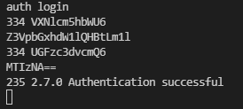
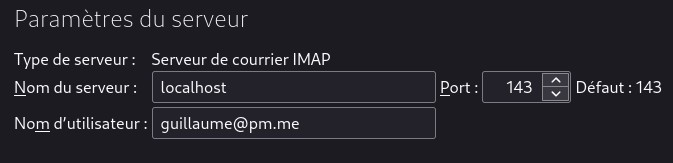
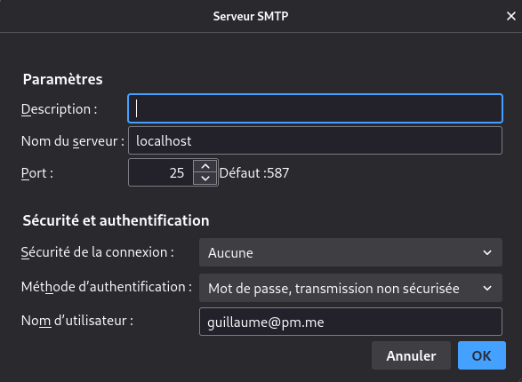
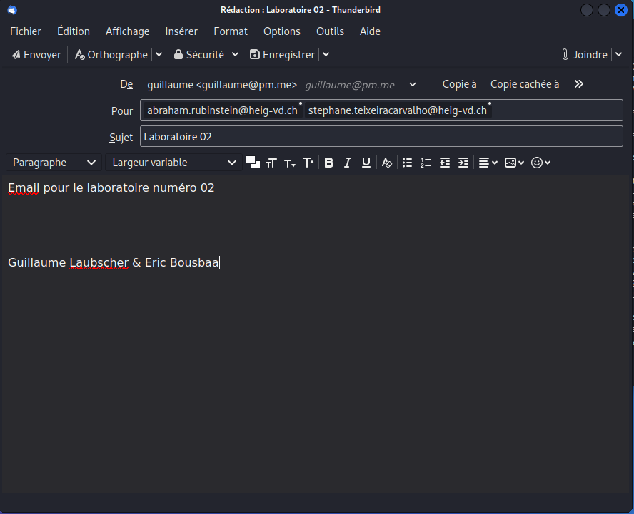
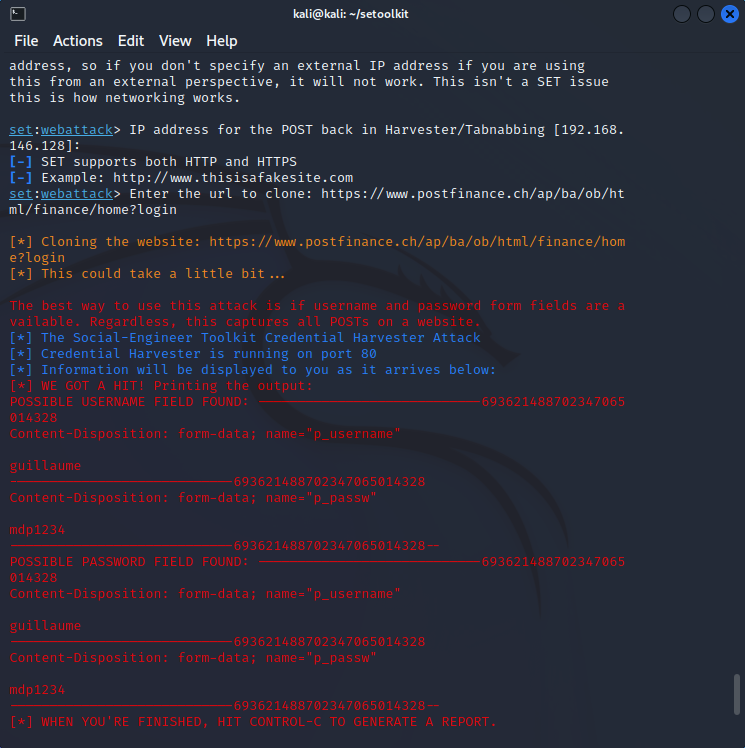
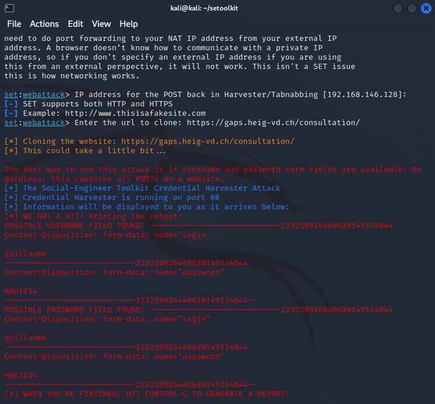
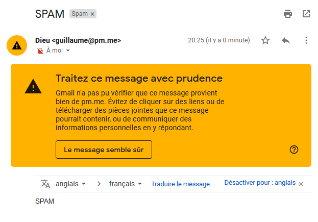
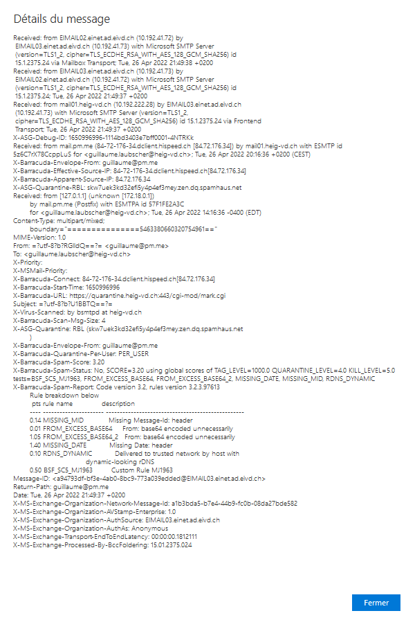

# Teaching-HEIGVD-SEN-2022-Laboratoire-Docker-Mail et SET


## Introduction

L'un des outils le plus important dans l'arsenal d'un ingénieur social c'est l'email. 

L'ingénierie sociale implique très souvent des interactions avec la cible. Ces interactions sont facilitées de nous jours par l'ubiquité des communications numériques. Il est tout à fait normal de recevoir des instructions par email de la part de supérieurs hiérarchiques ou des collègues pour réaliser toute sorte de tâches. Les destins de pays, des opérations financières multimilliardaires, des plans de construction d'un nouvel appareil; tout peut être transmis pas email.

L'email est aussi utilisé pour les relations privées. Ça peut être donc la voie de communication avec des membres de la famille, des amis, les conjoints, les fils et parents.

Pour complémenter le travail réalisé pour apprendre à connaitre la cible afin de la compromettre, l'ingénieur social a souvent besoin de délivrer une payload utilisant le même canal de communication. L'utilisation d'un serveur mail publique devient parfois compliqué. Si on essaie de faire une campagne de phishing, par exemple, l'emission d'un grand nombre de messages à des destinations différentes peut soulever une alarme qui vous met dans une liste noir. L'utilisation de certaines payloads peut aussi être détecté par votre serveur mail d'envoie.

Il est donc très intéressant de ne pas dépendre d'un serveur mail publique. Vous pouvez configurer votre propre serveur email avec quelques manipulations très simples. Ce serveur vous appartient. Il acceptera de faire tout ce que vous lui demanderez de faire, sans poser des questions.


## Une petite note sur l'éthique

Il n'est absolument pas acceptable d'attaquer quelqu'un pour quelque raison que ce soit. 

L'utilisation de ces outils à des fins autres que votre propre éducation et formation sans autorisation est strictement interdite par les politiques de ce cours et de l'école, ainsi que par les lois. 

Le but de cet exercice est de vous permettre de vous familiariser avec les outils et comment ils peuvent être utilisés dans le contexte professionnel d'un pentest. Ça vous permettra aussi de comprendre les tactiques de l'adversaire afin de pouvoir les contrer par le biais de la politique, de l'éducation et de la formation.


## Que faut-il faire ?

Voici les activités à réalise dans ce laboratoire. Vous devez : 

- Installer, configurer et tester votre propre serveur mail
- Installer le Social Engineering Toolkit (SET)
- Créer un collecteur d'identifiants (credential harvester)
- Capturer certains identifiants utilisateur (les vôtres)
- Créer une attaque de mailing utilisant SET et votre propre serveur mail

Le "rapport" de ce labo est très simple : **Pour chaque tâche, faites des captures d'écran de vos activités et répondez les éventuelles questions**.

## Docker Mailserver

Le projet [Docker Mailserver](https://github.com/docker-mailserver/docker-mailserver) est un système très complet et sophistiqué qui vous permet d'installer et utiliser votre propre serveur mail. Il est en même temps très simple et inclut des fonctionnalités avancées comme des filtres de spam et antivirus (justement ce que l'on veut éviter...).

Vous pouvez visiter le site du projet et apprendre beaucoup de choses à propos de cet outil très puissant. Nous allons pourtant nous contenter de faire un nombre assez réduit de manipulations dans le but de le faire fonctionner rapidement et avec peu d'effort. Ce n'est de loin la bonne utilisation de ce produit. En effet, il peut être déployé pour une utilisation en production. 

Notre scénario c'est celui d'un attaquant qui se sert de ce serveur pour délivrer des emails de phishing, par exemple, voir des payloads. Notre configuration de base ne nous permettra pas de recevoir des réponses aux mails. Si vous voulez être capable de recevoir des réponses (ce qui peut être le cas dans certains scénarios), il faudra faire du travail supplémentaire pour installer et configurer un serveur DNS capable de fournir des "MX records". La [documentation très complète de Docker Mailserver](https://docker-mailserver.github.io/docker-mailserver/edge/) contient entre autres les informations nécessaires pour configurer votre DNS. L'installation de certificats est aussi normalement important, mais ce ne sera pas fait pour le moment.

### Configuration minimaliste de Docker Mailserver

Nous avons testé ce guide sur Kali Linux et macOS Monterey. Son utilisation devrait être possible sur Windows avec peu ou pas de modification. Il vous faudra comprendre votre propre infrastructure afin de faire interagir correctement tous les éléments. 

Nous allons commencer par créer un répertoire "mailserver" et entrer dedans (ce guide part du principe que vous avez déjà Docker et Docker Compose installés et correctement configurés sur votre plateforme).

```bash
mkdir mailserver
cd mailserver
```
Ensuite, nous allons télécharger les 3 fichiers indispensables pour déployer le serveur. Vous n'êtes pas obligés de cloner le repo github entier.

```bash
DMS_GITHUB_URL='https://raw.githubusercontent.com/docker-mailserver/docker-mailserver/master'
wget "${DMS_GITHUB_URL}/docker-compose.yml"
wget "${DMS_GITHUB_URL}/mailserver.env"
wget "${DMS_GITHUB_URL}/setup.sh"
```

Finalement, nous allons rendre executable le script ```setup.sh```.

```bash
chmod a+x ./setup.sh
```

Le fichier ```mailserver.env```contient une énorme quantité de [variables d'environnement](https://docker-mailserver.github.io/docker-mailserver/edge/config/environment/) qui vous permettent de configurer votre serveur. La bonne nouvelle c'est que la configuration de base est déjà une version "clé en main". Vous pourriez ne rien modifier. Nous allons pourtant éditer le fichier et faire deux petits changements.

Ouvrez le fichier ```mailserver.env``` avec votre éditeur de texte préféré et trouvez la ligne qui fait référence à Amavis. Changez la ligne pour désactiver son utilisation:

```bash
ENABLE_AMAVIS = 0
```

---
#### Question : quelle est l'utilité de cette option ? C'est quoi Amavis ?

```
Réponse : D'après la [documentation mailserver](https://docker-mailserver.github.io/docker-mailserver/edge/config/environment/#enable_amavis) il s'agirait d'un filtre anti-spam pour emails. Amavis se place entre un agent de transferts de messages (MTA) et un service de filtre de contenu. 
Cette option désactive Amavis. Dans la mesure où on ne configure pas le réception d'email, il n'y a que peu d'utilité à avoir un service de filtre.
```

Cherchez ensuite la variable ```PERMIT_DOCKER``` dans ce même fichier et dans la documentation. Changez sa valeur à :

```bash
PERMIT_DOCKER=connected-networks
```

#### Question : Quelles sont les différentes options pour cette variable ? Quelle est son utilité ? (gardez cette information en tête si jamais vous avez des problèmes pour interagir avec votre serveur...)

```
Réponse : Les différentes options ->
 - **none** : Force l'authentification
 - **container** : N'accèpte que l'IP du container
 - **network** : Ajoute le pont réseau de docker par défaut (172.16.0.0/12)
 - connected-networks** : Ajoute tous les réseaux connectés de Docker (mais seulement en ipv4)

PERMIT_DOCKER permets de configurer le réseau pour fonctionner avec Docker.
```
---

Vous allez maintenant éditer le fichier ```docker-compose.yml```. Ce fichier contient aussi une configuration de base qui est fonctionnelle sans modification. Vous pouvez pourtant changer le ```domainname``` dans ce fichier. Vous pouvez choisir ce qui vous convient. Vous voulez utiliser ```gmail.com```? Allez-y ! C'est votre serveur !

La dernière partie de la configuration c'est la création d'un compte que vous pouvez utiliser pour envoyer vos emails. Il suffit d'utiliser la commande suivante, avec évidement les paramètres que vous désirez. Ce compte sera utilisé pour vous authentifier auprès de votre serveur mail :

```bash
./setup.sh email add vladimir@putin.ru password
```

Où ```vladimir@putin.ru```  c'est l'adresse email et le nom d'utilisateur qui seront crées et ```password``` est le mot de passe correspondant. 

### Installation et test

C'est le moment de télécharger l'image, créer le container et tester votre serveur. On utilise docker-compose :

```bash
docker-compose -f docker-compose.yml up -d
```

Vous pouvez vous servir de la commande ```docker ps``` pour vérifier que votre container est créé et en fonctionnement. 

Nous allons faire un test très basique pour nous assurer que le serveur fonctionne. Vous aurez besoin de ```telnet``` ou d'une commande équivalente (vous pouvez utiliser netcat, par exemple):

```bash
telnet localhost 25
```

Si votre serveur fonctionne correctement, il devrait vous saluer avec :

```bash
Connection to localhost port 25 [tcp/smtp] succeeded!
220 mail.whitehouse.gov ESMTP
```

Dans mon cas, j'ai configuré le domaine de mon serveur avec ```whitehouse.gov```

Vous pouvez ensuite établir une conversation avec votre serveur. Nous allons en particulier nous authentifier. Si vous ne vous authentifiez pas, le serveur refusera de vous laisser l'utiliser comme un relay (Relay access denied).

La commande pour l'authentification c'est ```AUTH LOGIN```. Vous devez ensuite transmettre votre username et votre mot de passe de l'utilisateur que vous avez créé, tous les deux en base64.

Voici ma conversation avec mon serveur :

```bash
arubinst@mailserver % nc -v localhost 25
Connection to localhost port 25 [tcp/smtp] succeeded!
220 mail.whitehouse.gov ESMTP
HELO rubinstein.gov
250 mail.whitehouse.gov
AUTH LOGIN
334 VXNlcm5hbWU6
dmxhZGltaXJAcHV0aW4ucnU=    <----- "vladimir@putin.ru" en base64
334 UGFzc3dvcmQ6
cGFzc3dvcmQ=                <----- "password" en base64
235 2.7.0 Authentication successful
```

---

#### Faire une capture de votre authentification auprès de votre serveur mail

```
Livrable : capture de votre conversation/authentification avec le serveur
```


---

### Configuration de votre client mail

Cette partie dépend de votre OS et votre client mail. Vous devez configurer sur votre client les paramètres de votre serveur SMTP pour pouvoir l'utiliser pour envoyer des messages.

---

### Montrez-nous votre configuration à l'aide d'une capture

```
Livrable : capture de votre configuration du serveur SMTP sur un client mail de votre choix
```





---

Vous pouvez maintenant vous servir de votre serveur SMTP pour envoyer des mails. Envoyez-vous un email à votre adresse de l'école pour le tester. 

Si tout fonctionne correctement, envoyez-nous (Stéphane et moi) un email utilisant votre serveur. Puisque vous avez certainement créé un faux compte email, n'oubliez pas de signer le message avec votre vraie nom pour nous permettre de vous identifier.

---
```
Livrable : capture de votre mail envoyé (si jamais il se fait bloquer par nos filtres de spam...
```


---

## The Social-Engineer Toolkit (SET) 

### A propos de SET

Selon la propre description donnée par [TrustedSec, LLC](https://www.trustedsec.com), la société de consulting américaine responsable du développement de ce produit, le [Social-Engineer Toolkit](https://github.com/trustedsec/social-engineer-toolkit/) est un framework de test d'intrusion open-source conçu pour l'ingénierie sociale. Le SET dispose d'un certain nombre de vecteurs d'attaque personnalisés qui vous permettent de réaliser rapidement une attaque crédible.

Le SET est spécifiquement conçu pour réaliser des attaques avancées contre l'élément humain. Il est rapidement devenu un outil standard dans l'arsenal des testeurs de pénétration. Les attaques intégrées dans la boîte à outils sont conçues pour être des attaques ciblées contre une personne ou une organisation utilisées lors d'un test de pénétration.

La réalité c'est que, en raison de l'évolution très rapide en matière de protection, cet outil fonctionne que partiellement. C'est un peu le jeu du chat et la souris. Le support pour certaines fonctionnalités est souvent utilisable pendant un certain temps et puis, rendu inutile. Cela reste quand-même très intéressant à le surveiller et à l'essayer.


### Téléchargement et installation de SET

Le SET est nativement supporté sur Linux et sur Mac OS X (experimental). Il est normalement préinstallé sur Kali Linux et il est capable de se mettre à jour lui-même.

Pour une installation sur Ubuntu/Debian/Mac OS X (ou si vous ne le retrouvez pas sur Kali) :

```
git clone https://github.com/trustedsec/social-engineer-toolkit/ setoolkit/
cd setoolkit
pip3 install -r requirements.txt
python setup.py
```
### Execution de SET

Pour exécuter SET, dans votre terminal taper :

```
setoolkit
```

Dépendant de votre OS et de votre installation particulière, il est possible que certaines fonctionnalités ne soient pas disponibles au moins d'utiliser ```sudo```.

```
sudo setoolkit
```

### Credential Harvesting

Vous découvrirez l'un des outils les plus couramment utilisés par les ingénieurs sociaux et les acteurs malveillants pour tromper les cibles.

Nous allons essayer avec le site de Postfinance.

Dans le menu de SET, sélectionner l'option 1, attaques de Social Engineering.


Ensuite, l'option 2 vous permettra de sélectionner les attaques Web.


Vous voulez maintenant l'option 3 pour le collecteur d'identifiants.


Et pour finir, l'option 2 pour cloner un site web.


Il faudra maintenant remplir deux informations : 

(1) l'adresse IP qui réceptionne la requête POST de votre site cloné. Dans notre cas, vous allez très probablement laisser la valeur par défaut proposée par SET (votre adresse dans le NAT d'une machine virtuelle ou votre adresse locale). Si votre attaque est sur une cible externe et que vous récoltez les identifiants depuis un réseau local derrière un NAT, il vous faudra votre adresse publique et faire quelques manipulations de redirection de ports au niveau de votre routeur.

(2) L'url du site à cloner. 

Certains sites ne fonctionnent pas bien, voir pas du tout. Pour ces cas, il existe la possibilité de modifier localement le clone du site pour le faire fonctionner. On ne va pas le faire dans le cadre de ce labo. 

On a pourtant trouvé deux sites qui fonctionnent bien et que vous pouvez essayer. On avait déjà mentionné Postfinance. L'autre site, c'est notre cher et vénérable gaps :

- ```https://www.postfinance.ch/ap/ba/ob/html/finance/home?login```
- ```https://gaps.heig-vd.ch/consultation/```

---

#### Soumettre des captures d'écran

Pour le collecteur d'identifiants, montrez que vous avez cloné les deux sites proposés. Dans chaque cas, saisissez des fausses informations d'identification sur votre clone local, puis cliquez le bouton de connexion. Essayez d'autres sites qui puissent vous intéresser (rappel : ça ne marche pas toujours). Faites des captures d'écran des mots de passe collectés dans vos tests avec SET.





---

### Mass Mailer Attack

Essayez la fonction d'envoie de mails. Vous la trouvez dans "Social Engineering Attacks".

Sélectionnez l'option "Single Email Address". Vous avez le choix entre des modèles de mail préfabriqués ou de créer votre propre message.

Pour cet exercice, nous allons utiliser notre serveur mail que vous venez de configurer.

Les paramètres à remplir sont :

- Adresse email de destination (cible) - vous pouvez essayer votre adresse email de l'école, par exemple
- Sélectionner l'option "User your own server"
- From address : l'adresse email de l'expéditeur de votre message - à vous de choisir le personnage
- FROM NAME : le nom qui sera affiché dans le client mail de la cible
- Username open-relay : le compte que vous avez créé pour votre serveur mail
- Password open-relay : le mot-de-passe que vous avez donné à ce compte
- SMTP server : normalement ce sera ```localhost``` mais ça peut dépendre de votre cas
- Port : 25
- Flag high priority : à vous de choisir
- Joindre une pièce : pas en ce moment. Il faut répondre "n" deux foix

En fonction de beaucoup de paramètres (config de votre serveur mail, par exemple), il est fort probable que votre mail se fasse arrêter par le filtre de spam. Vous pouvez regarder [le filtre de spam de l'école](https://quarantine.heig-vd.ch). Si vous retrouvez votre mail, utilisez l'option "Deliver" pour le libérer. Vous retrouverez votre mail dans la boîte de réception.

Si votre mail s'est fait filtrer, lire les entêtes et analyser les informations rajoutées par le filtre de spam.

---
#### Question : Est-ce que votre mail s'est fait filtrer ? qu'es-ce qui a induit ce filtrage ?

```
Réponse : Oui, mon email c'est fait filter. Les raisons suivantes sont données:
 - Missing message-Id: header
 - From: base64 encoded unnecessarily
 - From: base64 encoded unnecessarily
 - Missing Date: header
 - Delivered to trusted network by host with dynamic-loking rDNS
 - Custom Rule MJ1963
```

Si vous avez une autre adresse email (adresse privée, par exemple), vous pouvez l'utiliser comme cible, soumettre une capture et répondre à la question. 

---
#### Question : Est-ce que votre mail s'est fait filtrer dans ce cas-ci ? Montrez une capture.

```
Réponse et capture : Oui, l'email c'est fait filtrer et déplacer dans les spam par Gmail 🥲
```



---

### Explorer les liens "Phishy" et le courrier électronique "Phishy"

Pour cette dernière partie de notre exploration du phishing, nous allons utiliser un contenu réalisé par les  Dr. Matthew L. Hale, le Dr. Robin Gandhi et la Dr. Briana B. Morrison de [Nebraska GenCyber](
http://www.nebraskagencyber.com). 

Visitez : [https://mlhale.github.io/nebraska-gencyber-modules/phishing/README/ ](https://mlhale.github.io/nebraska-gencyber-modules/phishing/README/) et passez en revue les modules :

- Analyse d'url. **Ce module risque d'être beaucoup trop simple pour vous** mais il peut être très intéressant pour vos rapports de pentest, surtout comme outil pour sensibiliser les employés d'une entreprise. Gardez-le précieusement comme une partie de votre toolbox pour l'avenir.
- Analyse d'Email (ce module est probablement plus intéressant techniquement pour vous)

En général, c'est un bon exemple de matériel de formation et d'éducation qui peut aider à lutter contre les attaques de phishing et à sensibiliser le personnel d'une organisation.

Vous avez la liberté de reproduire et d'utiliser ce matériel grâce à sa licence.


#### Soumettre des captures d'écran

Pour cette tâche, prenez des captures d'écran de :

- Vos inspections d'un en-tête de courrier électronique à partir de votre propre boîte de réception



**1.** Les différentes informations qui se trouvent dans ces headers montre le chemin emprunté par le mail pour atteindre sa destination.

**2.** Le serveur de réçeption semble utiliser le service [barracuda](https://www.barracuda.com/products/emailsecuritygateway) pour la protection contre les spams.

**3.** Nous notons également qu’un «  X-Barracuda-Spam-Score» indique la probabilité que l’email reçu soit un spam. 1 ayant peu de chance d’être un spam et 10 définitivement un spam. Nous obtenons un résultat de **3.20**. 
En fonction du score, l'email sera remis au destinataire de la manière suivante : 
```
0.0 – 2.99 –> Déliveré dans la boîte de réception.
3.0 – 4.99 –> Déliveré dans la boîte de réception, avec un tag "email suspect".
5.0 – 6.99 –> Email mis en quarantaine.
7.0 – 10.0 –> Email bloqué.
```
Le header détaille également comment les points ont été calculés, pouvant nous aider à envoyer un email moins suspect. Notons que `MISSING_DATE` nous fait prendre 1.4 au score, ce qui ne devrait pas poser beaucoup de problèmes à corriger. Il en est de même pour `FROM_EXCESS_BASE64` qui serait un encodage base64 inutile.

**4.** Il est intéressant de noter que le `Return-Path` est spécifié. Généralement, un email de spam ne souhaiterait pas recevoir en retour un email pour chaque destinataire qui n'a pas pu être atteint.

#### Partagez avec nous vos conclusions.

```
Conclusions : 

Malgré quelques problèmes de configurations sur Windows et MacOS (puce M1), qui a nécessité pas mal de bidouillage, nous sommes surpris par la facilité qu’il y a pour créer un serveur mail. Pourtant omniprésents et considérés comme une source sûre, les mails sont pourtant aussi sécurisés qu’une Bentley dont on aurait les fenêtres ouvertes dans le Bronks. N’importe qui peut se faire passer pour n’importe qui, et il est facile de mettre en place une compagne de phising en se faisant passer pour le service des impôts, qui envoient un mail pour aider une retraitée à se faire rembourser son surplus payé. 
```
---

## Echeance

Le 14 avril 2022 à 10h25
