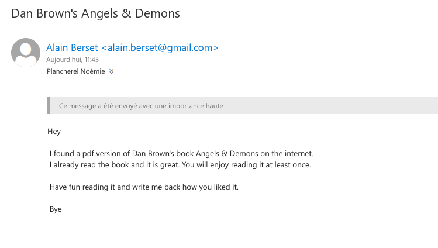

# Teaching-HEIGVD-SEN-2022-Laboratoire-Docker-Mail et SET

> Auteur: Noémie Plancherel

> Date: 14.04.22

## Introduction

L'un des outils le plus important dans l'arsenal d'un ingénieur social c'est l'email. 

L'ingénierie sociale implique très souvent des interactions avec la cible. Ces interactions sont facilitées de nous jours par l'ubiquité des communications numériques. Il est tout à fait normal de recevoir des instructions par email de la part de supérieurs hiérarchiques ou des collègues pour réaliser toute sorte de tâches. Les destins de pays, des opérations financières multimilliardaires, des plans de construction d'un nouvel appareil; tout peut être transmis pas email.

L'email est aussi utilisé pour les relations privées. Ça peut être donc la voie de communication avec des membres de la famille, des amis, les conjoints, les fils et parents.

Pour complémenter le travail réalisé pour apprendre à connaitre la cible afin de la compromettre, l'ingénieur social a souvent besoin de délivrer une payload utilisant le même canal de communication. L'utilisation d'un serveur mail publique devient parfois compliqué. Si on essaie de faire une campagne de phishing, par exemple, l'emission d'un grand nombre de messages à des destinations différentes peut soulever une alarme qui vous met dans une liste noir. L'utilisation de certaines payloads peut aussi être détecté par votre serveur mail d'envoie.

Il est donc très intéressant de ne pas dépendre d'un serveur mail publique. Vous pouvez configurer votre propre serveur email avec quelques manipulations très simples. Ce serveur vous appartient. Il acceptera de faire tout ce que vous lui demanderez de faire, sans poser des questions.


## Une petite note sur l'éthique

Il n'est absolument pas acceptable d'attaquer quelqu'un pour quelque raison que ce soit. 

L'utilisation de ces outils à des fins autres que votre propre éducation et formation sans autorisation est strictement interdite par les politiques de ce cours et de l'école, ainsi que par les lois. 

Le but de cet exercice est de vous permettre de vous familiariser avec les outils et comment ils peuvent être utilisés dans le contexte professionnel d'un pentest. Ça vous permettra aussi de comprendre les tactiques de l'adversaire afin de pouvoir les contrer par le biais de la politique, de l'éducation et de la formation.


## Que faut-il faire ?

Voici les activités à réalise dans ce laboratoire. Vous devez : 

- Installer, configurer et tester votre propre serveur mail
- Installer le Social Engineering Toolkit (SET)
- Créer un collecteur d'identifiants (credential harvester)
- Capturer certains identifiants utilisateur (les vôtres)
- Créer une attaque de mailing utilisant SET et votre propre serveur mail

Le "rapport" de ce labo est très simple : **Pour chaque tâche, faites des captures d'écran de vos activités et répondez les éventuelles questions**.

## Docker Mailserver

Le projet [Docker Mailserver](https://github.com/docker-mailserver/docker-mailserver) est un système très complet et sophistiqué qui vous permet d'installer et utiliser votre propre serveur mail. Il est en même temps très simple et inclut des fonctionnalités avancées comme des filtres de spam et antivirus (justement ce que l'on veut éviter...).

Vous pouvez visiter le site du projet et apprendre beaucoup de choses à propos de cet outil très puissant. Nous allons pourtant nous contenter de faire un nombre assez réduit de manipulations dans le but de le faire fonctionner rapidement et avec peu d'effort. Ce n'est de loin la bonne utilisation de ce produit. En effet, il peut être déployé pour une utilisation en production. 

Notre scénario c'est celui d'un attaquant qui se sert de ce serveur pour délivrer des emails de phishing, par exemple, voir des payloads. Notre configuration de base ne nous permettra pas de recevoir des réponses aux mails. Si vous voulez être capable de recevoir des réponses (ce qui peut être le cas dans certains scénarios), il faudra faire du travail supplémentaire pour installer et configurer un serveur DNS capable de fournir des "MX records". La [documentation très complète de Docker Mailserver](https://docker-mailserver.github.io/docker-mailserver/edge/) contient entre autres les informations nécessaires pour configurer votre DNS. L'installation de certificats est aussi normalement important, mais ce ne sera pas fait pour le moment.

### Configuration minimaliste de Docker Mailserver

Nous avons testé ce guide sur Kali Linux et macOS Monterey. Son utilisation devrait être possible sur Windows avec peu ou pas de modification. Il vous faudra comprendre votre propre infrastructure afin de faire interagir correctement tous les éléments. 

Nous allons commencer par créer un répertoire "mailserver" et entrer dedans (ce guide part du principe que vous avez déjà Docker et Docker Compose installés et correctement configurés sur votre plateforme).

```bash
mkdir mailserver
cd mailserver
```
Ensuite, nous allons télécharger les 3 fichiers indispensables pour déployer le serveur. Vous n'êtes pas obligés de cloner le repo github entier.

```bash
DMS_GITHUB_URL='https://raw.githubusercontent.com/docker-mailserver/docker-mailserver/master'
wget "${DMS_GITHUB_URL}/docker-compose.yml"
wget "${DMS_GITHUB_URL}/mailserver.env"
wget "${DMS_GITHUB_URL}/setup.sh"
```

Finalement, nous allons rendre executable le script ```setup.sh```.

```bash
chmod a+x ./setup.sh
```

Le fichier ```mailserver.env```contient une énorme quantité de [variables d'environnement](https://docker-mailserver.github.io/docker-mailserver/edge/config/environment/) qui vous permettent de configurer votre serveur. La bonne nouvelle c'est que la configuration de base est déjà une version "clé en main". Vous pourriez ne rien modifier. Nous allons pourtant éditer le fichier et faire deux petits changements.

Ouvrez le fichier ```mailserver.env``` avec votre éditeur de texte préféré et trouvez la ligne qui fait référence à Amavis. Changez la ligne pour désactiver son utilisation:

```bash
ENABLE_AMAVIS = 0
```

---
#### Question : quelle est l'utilité de cette option ? C'est quoi Amavis ?

```
Réponse : L'option va permettre d'activer ou pas le filtre Amavis. Amavis est un filtre pour les messageries qui va permettre de checker le contenu des e-mails. Il va fonctionner comme un scanner de virus et/ou un SpamAssassin (filtre le trafic d'e-mails pour enlever ceux reconnus comme spam ou non-voulus).
```

Cherchez ensuite la variable ```PERMIT_DOCKER``` dans ce même fichier et dans la documentation. Changez sa valeur à :

```bash
PERMIT_DOCKER=connected-networks
```

#### Question : Quelles sont les différentes options pour cette variable ? Quelle est son utilité ? (gardez cette information en tête si jamais vous avez des problèmes pour interagir avec votre serveur...)

```
Réponse : 
none: force explicitement l'authentification
container: uniquement l'adresse IP du conteneur
host: ajoute un réseau de conteneur docker (ipv4)
network: ajoute le réseau bridge par défaut de docker (172.16.0.0/12)
connecter-networks: ajoute tout les réseaux docker connectés (ipv4)
----------------------------------------------------------------------
permit_docker permet de définir la gateway docker à utiliser
```
---

Vous allez maintenant éditer le fichier ```docker-compose.yml```. Ce fichier contient aussi une configuration de base qui est fonctionnelle sans modification. Vous pouvez pourtant changer le ```domainname``` dans ce fichier. Vous pouvez choisir ce qui vous convient. Vous voulez utiliser ```gmail.com```? Allez-y ! C'est votre serveur !

La dernière partie de la configuration c'est la création d'un compte que vous pouvez utiliser pour envoyer vos emails. Il suffit d'utiliser la commande suivante, avec évidement les paramètres que vous désirez. Ce compte sera utilisé pour vous authentifier auprès de votre serveur mail :

```bash
./setup.sh email add vladimir@putin.ru password
```

Où ```vladimir@putin.ru```  c'est l'adresse email et le nom d'utilisateur qui seront crées et ```password``` est le mot de passe correspondant. 

### Installation et test

C'est le moment de télécharger l'image, créer le container et tester votre serveur. On utilise docker-compose :

```bash
docker-compose -f docker-compose.yml up -d
```

Commande qui fonctionne chez moi:

```sh
sudo ~/.docker/cli-plugins/docker-compose -f docker-compose.yml up -d
```

Vous pouvez vous servir de la commande ```docker ps``` pour vérifier que votre container est créé et en fonctionnement. 

Nous allons faire un test très basique pour nous assurer que le serveur fonctionne. Vous aurez besoin de ```telnet``` ou d'une commande équivalente (vous pouvez utiliser netcat, par exemple):

```bash
telnet localhost 25
```

Si votre serveur fonctionne correctement, il devrait vous saluer avec :

```bash
Connection to localhost port 25 [tcp/smtp] succeeded!
220 mail.whitehouse.gov ESMTP
```

Dans mon cas, j'ai configuré le domaine de mon serveur avec ```whitehouse.gov```

Vous pouvez ensuite établir une conversation avec votre serveur. Nous allons en particulier nous authentifier. Si vous ne vous authentifiez pas, le serveur refusera de vous laisser l'utiliser comme un relay (Relay access denied).

La commande pour l'authentification c'est ```AUTH LOGIN```. Vous devez ensuite transmettre votre username et votre mot de passe de l'utilisateur que vous avez créé, tous les deux en base64.

Voici ma conversation avec mon serveur :

```bash
arubinst@mailserver % nc -v localhost 25
Connection to localhost port 25 [tcp/smtp] succeeded!
220 mail.whitehouse.gov ESMTP
HELO rubinstein.gov
250 mail.whitehouse.gov
AUTH LOGIN
334 VXNlcm5hbWU6
dmxhZGltaXJAcHV0aW4ucnU=    <----- "vladimir@putin.ru" en base64
334 UGFzc3dvcmQ6
cGFzc3dvcmQ=                <----- "password" en base64
235 2.7.0 Authentication successful
```

---

#### Faire une capture de votre authentification auprès de votre serveur mail

```
Livrable : capture de votre conversation/authentification avec le serveur
```


---

### Configuration de votre client mail

Cette partie dépend de votre OS et votre client mail. Vous devez configurer sur votre client les paramètres de votre serveur SMTP pour pouvoir l'utiliser pour envoyer des messages.

---

### Montrez-nous votre configuration à l'aide d'une capture

```
Livrable : capture de votre configuration du serveur SMTP sur un client mail de votre choix
```

J'ai décidé d'utiliser Thunderbird comme client mail.


/!\ La configuration est correcte mais pour la suite du laboratoire, j'ai changé de username `malicious@gmail.com`, mais la configuration des ports, mot de passe et hostname reste la même.

---

Vous pouvez maintenant vous servir de votre serveur SMTP pour envoyer des mails. Envoyez-vous un email à votre adresse de l'école pour le tester. 

Si tout fonctionne correctement, envoyez-nous (Stéphane et moi) un email utilisant votre serveur. Puisque vous avez certainement créé un faux compte email, n'oubliez pas de signer le message avec votre vraie nom pour nous permettre de vous identifier.

---
```
Livrable : capture de votre mail envoyé (si jamais il se fait bloquer par nos filtres de spam...
```


---

## The Social-Engineer Toolkit (SET) 

### A propos de SET

Selon la propre description donnée par [TrustedSec, LLC](https://www.trustedsec.com), la société de consulting américaine responsable du développement de ce produit, le [Social-Engineer Toolkit](https://github.com/trustedsec/social-engineer-toolkit/) est un framework de test d'intrusion open-source conçu pour l'ingénierie sociale. Le SET dispose d'un certain nombre de vecteurs d'attaque personnalisés qui vous permettent de réaliser rapidement une attaque crédible.

Le SET est spécifiquement conçu pour réaliser des attaques avancées contre l'élément humain. Il est rapidement devenu un outil standard dans l'arsenal des testeurs de pénétration. Les attaques intégrées dans la boîte à outils sont conçues pour être des attaques ciblées contre une personne ou une organisation utilisées lors d'un test de pénétration.

La réalité c'est que, en raison de l'évolution très rapide en matière de protection, cet outil fonctionne que partiellement. C'est un peu le jeu du chat et la souris. Le support pour certaines fonctionnalités est souvent utilisable pendant un certain temps et puis, rendu inutile. Cela reste quand-même très intéressant à le surveiller et à l'essayer.


### Téléchargement et installation de SET

Le SET est nativement supporté sur Linux et sur Mac OS X (experimental). Il est normalement préinstallé sur Kali Linux et il est capable de se mettre à jour lui-même.

Pour une installation sur Ubuntu/Debian/Mac OS X (ou si vous ne le retrouvez pas sur Kali) :

```
git clone https://github.com/trustedsec/social-engineer-toolkit/ setoolkit/
cd setoolkit
pip3 install -r requirements.txt
python setup.py
```
### Execution de SET

Pour exécuter SET, dans votre terminal taper :

```
setoolkit
```

Dépendant de votre OS et de votre installation particulière, il est possible que certaines fonctionnalités ne soient pas disponibles au moins d'utiliser ```sudo```.

```
sudo setoolkit
```

### Credential Harvesting

Vous découvrirez l'un des outils les plus couramment utilisés par les ingénieurs sociaux et les acteurs malveillants pour tromper les cibles.

Nous allons essayer avec le site de Postfinance.

Dans le menu de SET, sélectionner l'option 1, attaques de Social Engineering.


Ensuite, l'option 2 vous permettra de sélectionner les attaques Web.


Vous voulez maintenant l'option 3 pour le collecteur d'identifiants.


Et pour finir, l'option 2 pour cloner un site web.


Il faudra maintenant remplir deux informations : 

(1) l'adresse IP qui réceptionne la requête POST de votre site cloné. Dans notre cas, vous allez très probablement laisser la valeur par défaut proposée par SET (votre adresse dans le NAT d'une machine virtuelle ou votre adresse locale). Si votre attaque est sur une cible externe et que vous récoltez les identifiants depuis un réseau local derrière un NAT, il vous faudra votre adresse publique et faire quelques manipulations de redirection de ports au niveau de votre routeur.

(2) L'url du site à cloner. 

Certains sites ne fonctionnent pas bien, voir pas du tout. Pour ces cas, il existe la possibilité de modifier localement le clone du site pour le faire fonctionner. On ne va pas le faire dans le cadre de ce labo. 

On a pourtant trouvé deux sites qui fonctionnent bien et que vous pouvez essayer. On avait déjà mentionné Postfinance. L'autre site, c'est notre cher et vénérable gaps :

- ```https://www.postfinance.ch/ap/ba/ob/html/finance/home?login```
- ```https://gaps.heig-vd.ch/consultation/```

---

#### Soumettre des captures d'écran

Pour le collecteur d'identifiants, montrez que vous avez cloné les deux sites proposés. Dans chaque cas, saisissez des fausses informations d'identification sur votre clone local, puis cliquez le bouton de connexion. Essayez d'autres sites qui puissent vous intéresser (rappel : ça ne marche pas toujours). Faites des captures d'écran des mots de passe collectés dans vos tests avec SET.

> PostFinance

Ci-dessous le site de la PostFinance cloné, nous pouvons remarquer que par défaut le site est en allemand. J'ai constaté que si on voulait changer de langue, on était redirigés sur la bonne url.


J'ai tenté de me connecter avec plusieurs login différents, nous voyons qu'on peut intercepter le username ainsi que le mot de passe.


> GAPS

Le deuxième site clôné est GAPS. 


Nous avons également pu récupérer quelques logins que j'ai entré.


> Migros

Finalement, j'ai testé de cloner le site de la Migros et cela a fonctionné.


---

J'ai également pu récupérer les identifiants. On peut constater qu'on intercepte également les valeurs captcha.


### Mass Mailer Attack

Essayez la fonction d'envoie de mails. Vous la trouvez dans "Social Engineering Attacks".

Sélectionnez l'option "Single Email Address". Vous avez le choix entre des modèles de mail préfabriqués ou de créer votre propre message.

Pour cet exercice, nous allons utiliser notre serveur mail que vous venez de configurer.

Les paramètres à remplir sont :

- Adresse email de destination (cible) - vous pouvez essayer votre adresse email de l'école, par exemple
- Sélectionner l'option "User your own server"
- From address : l'adresse email de l'expéditeur de votre message - à vous de choisir le personnage
- FROM NAME : le nom qui sera affiché dans le client mail de la cible
- Username open-relay : le compte que vous avez créé pour votre serveur mail
- Password open-relay : le mot-de-passe que vous avez donné à ce compte
- SMTP server : normalement ce sera ```localhost``` mais ça peut dépendre de votre cas
- Port : 25
- Flag high priority : à vous de choisir
- Joindre une pièce : pas en ce moment. Il faut répondre "n" deux foix

En fonction de beaucoup de paramètres (config de votre serveur mail, par exemple), il est fort probable que votre mail se fasse arrêter par le filtre de spam. Vous pouvez regarder [le filtre de spam de l'école](https://quarantine.heig-vd.ch). Si vous retrouvez votre mail, utilisez l'option "Deliver" pour le libérer. Vous retrouverez votre mail dans la boîte de réception.

Si votre mail s'est fait filtrer, lire les entêtes et analyser les informations rajoutées par le filtre de spam.

---
#### Question : Est-ce que votre mail s'est fait filtrer ? qu'es-ce qui a induit ce filtrage ?

```
Réponse : Oui le mail s'est fait filtrer. En regardant le rapport de spam, nous remarquons qu'il manque quelques informations dans l'e-mail. Notammant il manque un header du Message-ID ou encore le header de la date. Et il y'a également des informations qui sont codées en base-64 alors que ce n'est pas du tout nécessaire.
Une autre raison de ce filtre pourrait être dû au nom de domaine gmail. Ci-dessous les raisons de la quarantaine:
X-Barracuda-Spam-Report: Code version 3.2, rules version 3.2.3.97185
	Rule breakdown below
	 pts rule name              description
	---- ---------------------- --------------------------------------------------
	0.14 MISSING_MID            Missing Message-Id: header
	0.01 FROM_EXCESS_BASE64     From: base64 encoded unnecessarily
	0.00 MISSING_MIMEOLE        Message has X-MSMail-Priority, but no X-MimeOLE
	1.40 MISSING_DATE           Missing Date: header
	1.05 FROM_EXCESS_BASE64_2   From: base64 encoded unnecessarily
	1.50 BSF_SC0_MV1001         Custom rule MV1001
```


Si vous avez une autre adresse email (adresse privée, par exemple), vous pouvez l'utiliser comme cible, soumettre une capture et répondre à la question. 

---
#### Question : Est-ce que votre mail s'est fait filtrer dans ce cas-ci ? Montrez une capture.

```
Réponse et capture : Oui le mail s'est également fait filtrer (avec le serveur Gmail). Je n'ai pas pu le trouver dans ma boîte de réception. Je n'ai malheureusement pas pu y avoir accès sur ma boîte mail car il n'était pas non plus dans les spams.
```
Voici la capture du mail que j'ai reçu sur mon adresse e-mail de l'école après avoir libérer le mail mis en quarantaine:



---

### Explorer les liens "Phishy" et le courrier électronique "Phishy"

Pour cette dernière partie de notre exploration du phishing, nous allons utiliser un contenu réalisé par les  Dr. Matthew L. Hale, le Dr. Robin Gandhi et la Dr. Briana B. Morrison de [Nebraska GenCyber](
http://www.nebraskagencyber.com). 

Visitez : [https://mlhale.github.io/nebraska-gencyber-modules/phishing/README/ ](https://mlhale.github.io/nebraska-gencyber-modules/phishing/README/) et passez en revue les modules :

- Analyse d'url. **Ce module risque d'être beaucoup trop simple pour vous** mais il peut être très intéressant pour vos rapports de pentest, surtout comme outil pour sensibiliser les employés d'une entreprise. Gardez-le précieusement comme une partie de votre toolbox pour l'avenir.
- Analyse d'Email (ce module est probablement plus intéressant techniquement pour vous)

En général, c'est un bon exemple de matériel de formation et d'éducation qui peut aider à lutter contre les attaques de phishing et à sensibiliser le personnel d'une organisation.

Vous avez la liberté de reproduire et d'utiliser ce matériel grâce à sa licence.


#### Soumettre des captures d'écran

Pour cette tâche, prenez des captures d'écran de :

- Vos inspections d'un en-tête de courrier électronique à partir de votre propre boîte de réception

Nous pouvons analyser le mail que j'ai envoyé avant sur mon adresse e-mail de l'école et qui a été mis en quarantaine:

```
Received: from EIMAIL02.einet.ad.eivd.ch (10.192.xx.xx) by
 EIMAIL03.einet.ad.eivd.ch (10.192.xx.xx) with Microsoft SMTP Server
 (version=TLS1_2, cipher=TLS_ECDHE_RSA_WITH_AES_128_GCM_SHA256) id
 15.1.2375.24 via Mailbox Transport; Thu, 7 Apr 2022 11:43:12 +0200
Received: from EIMAIL03.einet.ad.eivd.ch (10.192.41.73) by
 EIMAIL02.einet.ad.eivd.ch (10.192.xx.xx) with Microsoft SMTP Server
 (version=TLS1_2, cipher=TLS_ECDHE_RSA_WITH_AES_128_GCM_SHA256) id
 15.1.2375.24; Thu, 7 Apr 2022 11:43:12 +0200
Received: from mail01.heig-vd.ch (10.192.xx.xx) by EIMAIL03.einet.ad.eivd.ch
 (10.192.41.73) with Microsoft SMTP Server (version=TLS1_2,
 cipher=TLS_ECDHE_RSA_WITH_AES_128_GCM_SHA256) id 15.1.2375.24 via Frontend
 Transport; Thu, 7 Apr 2022 11:43:12 +0200
X-ASG-Debug-ID: 1649324506-1114bd34038d52c0001-u80tGM
Received: from mail.gmail.com ([10.192.xx.xx]) by mail01.heig-vd.ch with ESMTP id 0qkMBUt4dGjISrYg for <noemie.plancherel@heig-vd.ch>; Thu, 07 Apr 2022 11:41:46 +0200 (CEST)
X-Barracuda-Envelope-From: alain.berset@gmail.com
X-Barracuda-RBL-Trusted-Forwarder: 10.192.xx.xx
Received: from [127.0.1.1] (unknown [172.18.0.1])
	by mail.gmail.com (Postfix) with ESMTPA id 5132B40405F
	for <noemie.plancherel@heig-vd.ch>; Thu,  7 Apr 2022 11:41:46 +0200 (CEST)
Content-Type: multipart/mixed;
	boundary="===============2745661135934007647=="
MIME-Version: 1.0
From: =?utf-8?b?QWxhaW4gQmVyc2V0?= <alain.berset@gmail.com>
To: <noemie.plancherel@heig-vd.ch>
X-Priority: 1 (Highest)
X-MSMail-Priority: High
X-Barracuda-Connect: UNKNOWN[10.192.xx.xx]
X-Barracuda-Start-Time: 1649324506
X-Barracuda-URL: https://quarantine.heig-vd.ch:443/cgi-mod/mark.cgi
Subject: =?utf-8?b?RGFuIEJyb3duJ3MgQW5nZWxzICYgRGVtb25z?=
X-Virus-Scanned: by bsmtpd at heig-vd.ch
X-Barracuda-Scan-Msg-Size: 240
X-Barracuda-BRTS-Status: 1
X-Barracuda-Envelope-From: alain.berset@gmail.com
X-Barracuda-Quarantine-Per-User: PER_USER
X-Barracuda-Spam-Score: 4.10
X-Barracuda-Spam-Status: Yes, SCORE=4.10 using global scores of TAG_LEVEL=1000.0 QUARANTINE_LEVEL=4.0 KILL_LEVEL=5.0 tests=BSF_SC0_MV1001, FROM_EXCESS_BASE64, FROM_EXCESS_BASE64_2, MISSING_DATE, MISSING_MID, MISSING_MIMEOLE
X-Barracuda-Spam-Report: Code version 3.2, rules version 3.2.3.97185
	Rule breakdown below
	 pts rule name              description
	---- ---------------------- --------------------------------------------------
	0.14 MISSING_MID            Missing Message-Id: header
	0.01 FROM_EXCESS_BASE64     From: base64 encoded unnecessarily
	0.00 MISSING_MIMEOLE        Message has X-MSMail-Priority, but no X-MimeOLE
	1.40 MISSING_DATE           Missing Date: header
	1.05 FROM_EXCESS_BASE64_2   From: base64 encoded unnecessarily
	1.50 BSF_SC0_MV1001         Custom rule MV1001
Message-ID: <432f285e-2838-4e19-8ebe-147c43fc07d5@EIMAIL03.einet.ad.eivd.ch>
Return-Path: alain.berset@gmail.com
Date: Thu, 7 Apr 2022 11:43:12 +0200
X-MS-Exchange-Organization-Network-Message-Id: c0c9f7c3-46d2-495f-5704-08da187b0836
X-MS-Exchange-Organization-AVStamp-Enterprise: 1.0
X-MS-Exchange-Organization-AuthSource: EIMAIL03.einet.ad.eivd.ch
X-MS-Exchange-Organization-AuthAs: Anonymous
X-MS-Exchange-Transport-EndToEndLatency: 00:00:00.1852256
X-MS-Exchange-Processed-By-BccFoldering: 15.01.2375.024
```

On peut tout d'abord regarder le champ `Received`, nous voyons qu'il a bien été envoyé depuis le nom de domaine `mail.gmail.com` que j'avais configuré avec mon propre serveur de mail.

Sinon, on peut effectivement voir que le mail a été filtré et est considéré comme un spam avec le header `X-Barracuda-Spam-Score = 4.10` qui nous permet de voir le score de spam. 0.0 étant un mail considéré comme non-spam et 10.0, un spam. Comme indiqué plus haut, nous pouvons voir les raisons de ce score avec le header  `X-Barracuda-Spam-Report`.

On peut également vérifier le header `Return-Path` qui est censé matcher le champ `From`. Ainsi, nous constatons que les deux indiquent l'adresse `alain.berset@gmail.com`.

------

Ensuite, un e-mail considéré comme non-spam, également reçu sur mon adresse de l'école:

```
Received: from EIMAIL02.einet.ad.eivd.ch (10.192.xx.xx) by
 EIMAIL03.einet.ad.eivd.ch (10.192.xx.xx) with Microsoft SMTP Server
 (version=TLS1_2, cipher=TLS_ECDHE_RSA_WITH_AES_128_GCM_SHA256) id
 15.1.2375.24 via Mailbox Transport; Tue, 5 Apr 2022 08:34:07 +0200
Received: from EIMAIL02.einet.ad.eivd.ch (10.192.xx.xx) by
 EIMAIL02.einet.ad.eivd.ch (10.192.xx.xx) with Microsoft SMTP Server
 (version=TLS1_2, cipher=TLS_ECDHE_RSA_WITH_AES_128_GCM_SHA256) id
 15.1.2375.24; Tue, 5 Apr 2022 08:33:52 +0200
Received: from EIMAIL02.einet.ad.eivd.ch ([fe80::2163:2643:32bf:42e4]) by
 EIMAIL02.einet.ad.eivd.ch ([fe80::2163:2643:32bf:42e4%5]) with mapi id
 15.01.2375.024; Tue, 5 Apr 2022 08:33:52 +0200
Content-Type: application/ms-tnef; name="winmail.dat"
Content-Transfer-Encoding: binary
From: Compte Association AGE <age@heig-vd.ch>
To: Etudiants HEIG-VD <Etudiants.HEIG-VD@heig-vd.ch>
Subject: BurgerQuizzzzzzzzzzzzzz !!!!!!!!!!!!!!!!!!! 
Thread-Topic: BurgerQuizzzzzzzzzzzzzz !!!!!!!!!!!!!!!!!!! 
Thread-Index: AQHYSLX1sf3P5V+JUE+ZvVFDr0FZew==
Date: Tue, 5 Apr 2022 08:33:52 +0200
Message-ID: <cb16df2b64444f4487dec5877635adbd@heig-vd.ch>
Accept-Language: fr-FR, fr-CH, en-US
Content-Language: fr-FR
X-MS-Has-Attach: yes
X-MS-Exchange-Organization-SCL: -1
X-MS-TNEF-Correlator: <cb16df2b64444f4487dec5877635adbd@heig-vd.ch>
MIME-Version: 1.0
X-MS-Exchange-Organization-MessageDirectionality: Originating
X-MS-Exchange-Organization-AuthSource: EIMAIL02.einet.ad.eivd.ch
X-MS-Exchange-Organization-AuthAs: Internal
X-MS-Exchange-Organization-AuthMechanism: 04
X-Originating-IP: [10.192.xx.xx]
X-MS-Exchange-Organization-Network-Message-Id: 453818c9-6eeb-4363-02bb-08da16ce4070
Return-Path: age@heig-vd.ch
X-MS-Exchange-Organization-AVStamp-Enterprise: 1.0
X-Auto-Response-Suppress: DR, OOF, AutoReply
X-MS-Exchange-Transport-EndToEndLatency: 00:00:15.2505126
X-MS-Exchange-Processed-By-BccFoldering: 15.01.2375.024
```

En comparaison avec l'en-tête précédent, nous voyons qu'il est beaucoup moins long dû aux headers `Barracuda` qui ne sont pas présents car le mail n'est pas considéré comme spam, sûrement car le destinataire est une adresse mail de l'école (`age@heig-vd.ch`).

Le `Return-Path` ainsi que le `From` matchent les deux.

------

Finalement, un e-mail considéré comme spam:

```
Received: from VI1P190MB0320.EURP190.PROD.OUTLOOK.COM (2603:10a6:802:2d::11)
 by DU0P190MB1707.EURP190.PROD.OUTLOOK.COM with HTTPS; Thu, 7 Apr 2022
 13:22:34 +0000
Received: from VI1PR09CA0156.eurprd09.prod.outlook.com (2603:10a6:803:12c::40)
 by VI1P190MB0320.EURP190.PROD.OUTLOOK.COM (2603:10a6:802:2d::11) with
 Microsoft SMTP Server (version=TLS1_2,
 cipher=TLS_ECDHE_RSA_WITH_AES_256_GCM_SHA384) id 15.20.5123.31; Thu, 7 Apr
 2022 13:22:34 +0000
Received: from VI1PR06MB4686.eurprd06.prod.outlook.com
 (2603:10a6:803:12c:cafe::12) by VI1PR09CA0156.outlook.office365.com
 (2603:10a6:803:12c::40) with Microsoft SMTP Server (version=TLS1_2,
 cipher=TLS_ECDHE_RSA_WITH_AES_256_GCM_SHA384) id 15.20.5144.22 via Frontend
 Transport; Thu, 7 Apr 2022 13:22:33 +0000
Received: from AM6P195CA0070.EURP195.PROD.OUTLOOK.COM (2603:10a6:209:87::47)
 by VI1PR06MB4686.eurprd06.prod.outlook.com (2603:10a6:803:8d::28) with
 Microsoft SMTP Server (version=TLS1_2,
 cipher=TLS_ECDHE_RSA_WITH_AES_256_GCM_SHA384) id 15.20.5123.31; Thu, 7 Apr
 2022 13:21:29 +0000
Received: from VE1EUR02FT038.eop-EUR02.prod.protection.outlook.com
 (2603:10a6:209:87:cafe::12) by AM6P195CA0070.outlook.office365.com
 (2603:10a6:209:87::47) with Microsoft SMTP Server (version=TLS1_2,
 cipher=TLS_ECDHE_RSA_WITH_AES_256_GCM_SHA384) id 15.20.5144.22 via Frontend
 Transport; Thu, 7 Apr 2022 13:21:29 +0000
Authentication-Results: spf=fail (sender IP is 220.130.xx.xx)
 smtp.mailfrom=usa.org; dkim=none (message not signed)
 header.d=none;dmarc=none action=none header.from=usa.org;compauth=fail
 reason=001
Received-SPF: Fail (protection.outlook.com: domain of usa.org does not
 designate 220.130.xx.xx as permitted sender)
 receiver=protection.outlook.com; client-ip=220.130.xx.xx;
 helo=Exg2013.shinyeh.com.tw;
Received: from Exg2013.shinyeh.com.tw (220.130.xx.xx) by
 VE1EUR02FT038.mail.protection.outlook.com (10.152.xx.xx) with Microsoft SMTP
 Server (version=TLS1_2, cipher=TLS_ECDHE_RSA_WITH_AES_256_CBC_SHA384) id
 15.20.5144.20 via Frontend Transport; Thu, 7 Apr 2022 13:21:28 +0000
X-IncomingTopHeaderMarker:
OriginalChecksum:EF2181AB933926753A92970BCC4B9F723CBA9A3A3249A8E1D29BDDE551C50DC4;UpperCasedChecksum:FFEF0BFA6E5E03EFE47609DC8D6FF66CB4AA36C4F5A0D7B2BA1B1453C6069B44;SizeAsReceived:814;Count:13
Received: from Exg2013.shinyeh.com.tw (192.168.xx.xx) by Exg2013.shinyeh.com.tw
 (192.168.xx.xx) with Microsoft SMTP Server (TLS) id 15.0.1497.26; Thu, 7 Apr
 2022 04:08:13 +0800
Received: from [212.192.246.186] (212.192.xx.xx) by Exg2013.shinyeh.com.tw
 (192.168.xx.xx) with Microsoft SMTP Server id 15.0.1497.26 via Frontend
 Transport; Thu, 7 Apr 2022 04:08:08 +0800
Content-Type: text/plain; charset="iso-8859-1"
Content-Transfer-Encoding: quoted-printable
Content-Description: Mail message body
Subject: Hello Dear , Greeting To You.
To: Recipients <info@usa.org>
From: John Carroll Williams <info@usa.org>
Date: Wed, 6 Apr 2022 13:08:03 -0700
Reply-To: <mr.godwin001@aol.com>
Message-ID: <b79d0f6d553040f08385a74323a489de@Exg2013.shinyeh.com.tw>
Return-Path: info@usa.org
X-IncomingHeaderCount: 13
X-MS-Exchange-Organization-ExpirationStartTime: 07 Apr 2022 13:21:29.1733
 (UTC)
X-MS-Exchange-Organization-ExpirationStartTimeReason: OriginalSubmit
X-MS-Exchange-Organization-ExpirationInterval: 1:00:00:00.0000000
X-MS-Exchange-Organization-ExpirationIntervalReason: OriginalSubmit
X-MS-Exchange-Organization-Network-Message-Id:
 9a2a0bd2-4d48-4d17-c57e-08da1899867c
X-EOPAttributedMessage: 0
X-EOPTenantAttributedMessage: 84df9e7f-e9f6-40af-b435-aaaaaaaaaaaa:0
X-MS-Exchange-Organization-MessageDirectionality: Incoming
X-MS-PublicTrafficType: Email
X-MS-Office365-Filtering-Correlation-Id: 9a2a0bd2-4d48-4d17-c57e-08da1899867c
X-MS-TrafficTypeDiagnostic: VI1PR06MB4686:EE_|VI1P190MB0320:EE_
X-MS-Exchange-EOPDirect: true
X-Sender-IP: 220.130.155.161
X-SID-PRA: INFO@USA.ORG
X-SID-Result: FAIL
X-MS-Exchange-Organization-PCL: 2
X-MS-Exchange-Organization-SCL: 5
X-Microsoft-Antispam: BCL:0;
X-MS-Exchange-CrossTenant-OriginalArrivalTime: 07 Apr 2022 13:21:28.7671
 (UTC)
X-MS-Exchange-CrossTenant-Network-Message-Id: 9a2a0bd2-4d48-4d17-c57e-08da1899867c
X-MS-Exchange-CrossTenant-Id: 84df9e7f-e9f6-40af-b435-aaaaaaaaaaaa
X-MS-Exchange-CrossTenant-AuthSource: VE1EUR02FT038.eop-EUR02.prod.protection.outlook.com
X-MS-Exchange-CrossTenant-AuthAs: Anonymou
X-MS-Exchange-CrossTenant-FromEntityHeader: Internet
X-MS-Exchange-CrossTenant-RMS-PersistedConsumerOrg: 00000000-0000-0000-0000-000000000000
X-MS-Exchange-Transport-CrossTenantHeadersStamped: VI1PR06MB4686
X-MS-Exchange-Organization-AuthSource:
 VE1EUR02FT038.eop-EUR02.prod.protection.outlook.com
X-MS-Exchange-Organization-AuthAs: Anonymous
X-MS-UserLastLogonTime: 4/7/2022 1:17:30 PM
X-MS-Exchange-Transport-EndToEndLatency: 00:01:05.7024186
X-MS-Exchange-Processed-By-BccFoldering: 15.20.5123.031
X-Microsoft-Antispam-Mailbox-Delivery:	abwl:0;wl:0;pcwl:0;kl:0;iwl:0;dwl:0;dkl:0;rwl:0;ucf:0;jmr:0;ex:0;psp:0;auth:0;dest:J;OFR:SpamFilterAuthJ;ENG:(5062000285)(90000117)(90005022)(91005020)(91035115)(5061607266)(5061608174)(9050020)(9100338)(2008001134)(2008000189)(2008010094)(2102111067)(8390246)(8376100)(8383139)(210498285)(210499095)(4810004)(4910013)(7110002)(9610025)(9560006)(10180021)(9320005)(9245025);RF:JunkEmail;
X-Message-Info:
qoGN4b5S4yrmAeNVLAMFDslnOcoUsFCaH3ZBO/myiGJanS2jv0Ihc8V9xlSnn5CZM0bbHQmvG6VisxAzQfDcM7n29tfaLdKIyDoulMWx32ZIXUaba/dSaU1LTSOEqbq07WHdyP0GlO8eliK/phxb5QMaiF4h3+l32/jwbqoHSGbRMQGvzPSgT6WmGFr++7V3nElqbQd4s8II8rqNMzmO7g==
X-Message-Delivery: Vj0xLjE7dXM9MDtsPTA7YT0wO0Q9MjtHRD0yO1NDTD02
X-Microsoft-Antispam-Message-Info:
	=?iso-8859-1?Q?2PMbqzG7ZhfBDMlwJxBuN5a/APEp+2o7Udhr5s7azum3Cq1aH1uYQJxofX?=
 =?iso-8859-1?Q?eX7QZUBnHNVlSzMp0E2GA/6+zWlNAE1iFjNkYei72SbnVWUPpBu9IgDKjw?=
 =?iso-8859-1?Q?vVxkUd3etjJ9py0jUpZxa4DqUCjpvOFru/DZ/+3g60jWKGRHTcYd6Lwn7w?=
 =?iso-8859-1?Q?YYX+BvGYHjt9Xxw4O/FRBAIE9bYyOg5JfBy5ssd8K+FFeeuBe8h5fQCEbt?=
 =?iso-8859-1?Q?SsabgcG2pjGPpFP5qY46RpVevo8hwZL6F4Sj4mXscfW4+3OKV+dN3F1Qs8?=
 =?iso-8859-1?Q?Bo0o2diMgoP4ST/FYcS+JxPizyP/X1kkxRGWPj+wSWw396aiNZiTbcmkbO?=
 =?iso-8859-1?Q?/W6s0C2GFIHR+l2a/yPHTjWmPRZ03RhexvZV3BzJTxiOvY7/iz/xpY6CpJ?=
 =?iso-8859-1?Q?lVOipuFfG6wUe/0xZxpUY2dQzEudBRH2njb3Oy3svChvLwE5v65ihSpvqq?=
 =?iso-8859-1?Q?WwQLNwyxPOnqf7EZzZPsIuOuE1fj260ecFUJk6o7h4ZTxTYWiU1j7HkU8V?=
 =?iso-8859-1?Q?XqLEiAVzzJ/90IQxDfrqO8Z2YvZwJPW0kXr3ak4emF1kQrFWFmhdbW1PGN?=
 =?iso-8859-1?Q?aXlocfkTL6DCaDs6hREDIumvniZWPc32WqEl9lW56Sx2FefuaIksf+LhBW?=
 =?iso-8859-1?Q?mVPjVQ7JvWnRGTLZY/OMrBImmV3Y/eK4/n4SQisjr3x/QPYhmikx/aczzx?=
 =?iso-8859-1?Q?UsUV0Ep0KcfWOz49mHiBfliYAh/M2/6WVsRDK+ueCDaXba0ZX9zY0IpJak?=
 =?iso-8859-1?Q?mO60HLX+cp66yw7vhPxKxAK24rBwXvwITPWUnk8vWqIoQLxhxqargnuh6Q?=
 =?iso-8859-1?Q?4STspUcQ+7bHz9dwapFqRzw1WVaQigBeNL0HAubfJu5ASGXPEZpDPw7b2q?=
 =?iso-8859-1?Q?AcFJvmKm72GJ/kIeS4gu2mOti73y5Mtw4VBnqaA9tQE3Lvrwdh4YyiBFUM?=
 =?iso-8859-1?Q?H8XFdPIvIfnm4BEct1Lv0y9OMz2j7or7aGyQw/aflO2EurIcVvR9WB/FuP?=
 =?iso-8859-1?Q?on3J7b6rb+0KAW5hl5vpVcc4wHRByLs+iFxVHxne3tqirgOHEdSKnl9BmT?=
 =?iso-8859-1?Q?7V8g+VE1Wik4jpNqr6zR1eX9hvDL4tbM/8Y8GUlkLKfpKVpv2abHVz/GYW?=
 =?iso-8859-1?Q?Insc3DE4l+xRLN0lQQta0sYHvygE1mNKDIVUPEwyfQn9hb8/ZI/nZ6YEPp?=
 =?iso-8859-1?Q?1z6RHmqGmnHojZmLsCrBGHMvkPOX6jVTiH932BDvZzcfJ3Iz1LuYv1Xn8r?=
 =?iso-8859-1?Q?FL0ZfLIpCj5qsCLoC3UFjAeFvu/xgarcR5lHknjCOeP/SZd0Kis1kaWVfg?=
 =?iso-8859-1?Q?24KzogjMh24NOLvrXm//v+arsgA6oyYwXruKv7PegcHpI9R4z+LWEc4dzf?=
 =?iso-8859-1?Q?S5PbzSfHIMeI5Y41NPpX8racL+ILaESWcdb+bRQ/LCJkgjfLT3S4HLmkrY?
 =?iso-8859-1?Q?LmyA9YLOw+gixI3JTh/5tnxUHBSpigqPBSsz6s6Q5OaA/56UpvJn+INfeE?=
 =?iso-8859-1?Q?Oa1skV3rWpKo4Z/HD02LHtKtb5Cws/sXnwo/8UvHikFIPRf/hjuOtihZcP?=
 =?iso-8859-1?Q?RjQK1VNAdtkl72UdKhT+I//0WuOdZ9cfzC3RceAgryE9jH/BAwUMVJEoIz?=
 =?iso-8859-1?Q?wm5M64EWVmoueb4+W3ikM4hk0UeKtx++SIbjJVDQo5IqtAk0LtJ0d/gZup?=
 =?iso-8859-1?Q?t0C5YsL1Jsxk57j4jcRZczUOnqHpz2EBmcGWgdniR/yhA2hDbO4R9OcxCQ?=
 =?iso-8859-1?Q?5Xg398vhfm4bw977JEKuWfaeDoAFxrWEvBckTVVlYeLn0pRdTroxHrCgwP?=
 =?iso-8859-1?Q?whSQ7Qjx5IsWeUXsNOamkTE71hZeCZxip7qnQbZ7KpJNe9zrQr7SUKDBPQ?=
 =?iso-8859-1?Q?ttVTm2iYduLAaBQkJ0AXqMELkEZJVD+sx/A/niuPSdA7yUOILuUWzBjFHp?=
 =?iso-8859-1?Q?R7fy8/gvzg8+n5Mhv6AFGryV8+DgCGiDeq+Sy2d28OwNA9nz4jwz2j1osD?=
 =?iso-8859-1?Q?C5244nbd/qL0ZXXmNiZ8SaM56uFsjwJVelvHyV3/xjVK08Mg01ah4Jwhy6?=
 =?iso-8859-1?Q?WIgxFACp24IJkP0TDVtrB+LJZS5ybcaN8G/k9pE0aMkEJQbD4U71ofekT2?=
 =?iso-8859-1?Q?Xmo3be41/49U6P/6oSOMnqiHb5J4ypxuV6G7R2ZeQz1to8aa29ae1HUTV7?=
 =?iso-8859-1?Q?FhoF/rK2xRyG7A/3spM31Iql8zc8n57n0i0F8AP07CnsXZJdD5iS4njfKV?=
 =?iso-8859-1?Q?mz/7ugVIM=3D?=
MIME-Version: 1.0
{...}
```

Comparé aux e-mails précédents, nous voyons premièrement que la longueur est bien plus grande. Un détail important est le nombre de headers `Received` qu'on peut voir. Cet entête permet d'indiquer par quel serveur il est passé de la source vers le destinataire. La première entrée, c'est-à-dire le premier serveur à recevoir le mail, ressemble à cela:

```
Received: from [212.192.246.186] (212.192.246.186) by Exg2013.shinyeh.com.tw
 (192.168.xx.xx) with Microsoft SMTP Server id 15.0.1497.26 via Frontend
 Transport; Thu, 7 Apr 2022 04:08:08 +0800
```

En faisant une recherche `whois` avec l'adresse IP donnée et le nom de domaine, nous avons:

```sh
> whois Exg2013.shinyeh.com.tw
Domain Name: shinyeh.com.tw
   Domain Status: ok
   Registrant:
      欣葉國際餐飲股份有限公司
      Shinyeh
      Wu YUhong  kc022602@shinyeh.com.tw
      +886.22652899
      +886.22792739
      7F., No.223, Tanmei St., Neihu Dist., Taipei City 114, Taiwan (  
      台北市, 
      TW
> whois 212.192.246.186
{...}
inetnum:        212.192.244.0 - 212.192.247.255
netname:        Serverion
country:        NL
{...}
```

Nous remarquons que les deux pays sont opposés, donc on remarque qu'il y a déjà un problème.

Ensuite, nous voyons que dans `Authentication-Results` le spf est `fail`. Ceci veut dire que le nom de domaine venant de cette adresse IP n'est pas accepté par le serveur.

Finalement, il y a tous les headers Microsoft concernant le spam.

---
#### Partagez avec nous vos conclusions.

```
Conclusions : 
Il est assez intéressant d'apprendre à utiliser ces différents outils et surtout de savoir qu'ils existent. Ils pourront nous être très utiles pour notre futur travail.
Il est surprenant de voir à quel point il est "facile" de se faire passer par quelqu'un d'autre en bypassant, par exemple, les filtres spams des serveurs de mail.
L'outil SET est très complet et il permet de proposer plusieurs fonctionnalités différentes.
```
---

## Echeance

Le 14 avril 2022 à 10h25
